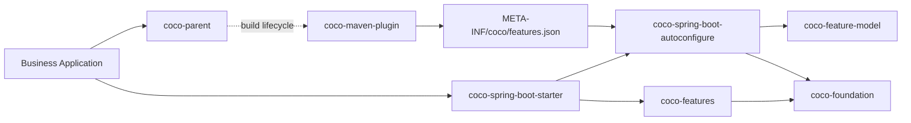

## Repository Architecture

<table>
  <thead>
    <tr>
      <th width="20%">Outer Directory</th>
      <th width="47%">Published Artifacts</th>
      <th width="33%">Responsibility</th>
    </tr>
  </thead>
  <tbody>
    <tr>
      <td><code>coco-build</code></td>
      <td><code>coco-dependencies</code>, <code>coco-parent</code>, <code>coco-maven-plugin</code></td>
      <td>Dependency management and application build lifecycle.</td>
    </tr>
    <tr>
      <td><code>coco-foundation</code></td>
      <td><code>coco-api</code>, <code>coco-context</code>, <code>coco-i18n</code>, <code>coco-exception</code>, <code>coco-logging</code>, <code>coco-feature-model</code></td>
      <td>Stable contracts and reusable infrastructure without auto-configuration or concrete feature ownership.</td>
    </tr>
    <tr>
      <td><code>coco-spring</code></td>
      <td><code>coco-spring-boot-autoconfigure</code>, <code>coco-spring-boot-starter</code></td>
      <td>Spring Boot integration and the single application entry point.</td>
    </tr>
    <tr>
      <td><code>coco-features</code></td>
      <td><code>coco-web</code>, <code>coco-security</code>, <code>coco-audit</code>, <code>coco-mybatis-plus</code>, <code>coco-tenant</code>, <code>coco-data-permission</code>, <code>coco-openapi</code></td>
      <td>Concrete, independently controlled server capabilities.</td>
    </tr>
    <tr>
      <td><code>coco-support</code></td>
      <td><code>coco-test-support</code></td>
      <td>Test support without production runtime ownership.</td>
    </tr>
  </tbody>
</table>

See [framework boundaries](./docs/architecture/framework-boundary.md), the [complete module layout](./docs/architecture/module-layout.md), and the [feature lifecycle](./docs/architecture/feature-lifecycle.md).

## Runtime Shape

