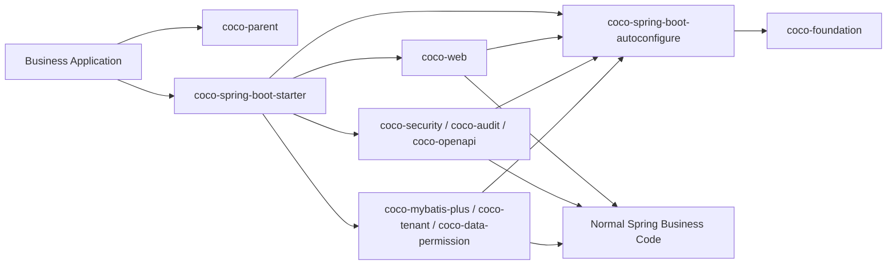

## Samples

<table>
  <thead>
    <tr>
      <th width="24%">Sample</th>
      <th width="46%">What It Proves</th>
      <th width="30%">Entry</th>
    </tr>
  </thead>
  <tbody>
    <tr>
      <td><strong>Basic</strong></td>
      <td>Web responses, exceptions, i18n, trace, signatures, encryption, and replay protection without a database.</td>
      <td><a href="./coco-samples/coco-sample-basic/README.md">Open sample</a></td>
    </tr>
    <tr>
      <td><strong>Full</strong></td>
      <td>H2 + MyBatis-Plus with security assertions, tenant SQL isolation, data-permission SQL filtering, and audit publication.</td>
      <td><a href="./coco-samples/coco-sample-full/README.md">Open sample</a></td>
    </tr>
  </tbody>
</table>

## Runtime Shape

### 2.x Compatibility Coordinates

The published `coco-config`, `coco-feature-runtime`, `coco-feature-web`, `coco-feature-mybatis-plus`, `coco-feature-audit`, `coco-feature-security`, `coco-feature-tenant`, `coco-feature-data-permission`, `coco-feature-openapi`, and `coco-test` coordinates remain resolvable throughout 2.x as source-free compatibility JARs under `coco-build/coco-compatibility`. They do not own implementation and are not internal dependency targets. New applications continue to use `coco-spring-boot-starter`; direct framework consumers use `coco-spring-boot-autoconfigure`, the canonical `coco-*` feature artifacts shown above, or `coco-test-support`. `coco-feature-codegen` is unchanged.
