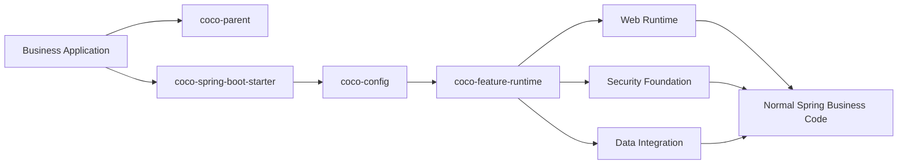

## Framework Acceptance

<table>
  <thead>
    <tr>
      <th width="24%">Acceptance Scenario</th>
      <th width="46%">What It Proves</th>
      <th width="30%">Entry</th>
    </tr>
  </thead>
  <tbody>
    <tr>
      <td><strong>Basic</strong></td>
      <td>Web responses, exceptions, i18n, trace, signatures, encryption, and replay protection without a database.</td>
      <td><a href="https://github.com/patton174/coco-admin/tree/main/framework-acceptance">Open coco-admin acceptance</a></td>
    </tr>
    <tr>
      <td><strong>Full</strong></td>
      <td>H2 + MyBatis-Plus with security assertions, tenant SQL isolation, data-permission SQL filtering, and audit publication.</td>
      <td><a href="https://github.com/patton174/coco-admin/tree/main/framework-acceptance">Open coco-admin acceptance</a></td>
    </tr>
  </tbody>
</table>

> **Stage 1 cleanup:** `coco-sample-full` and Basic `scripts/verify_business_flow.py` have been removed. The remaining Basic README, POM, Postman assets, source tree, and still-valid helper scripts are a temporary 2.x migration legacy: they are not a reactor module and are not invoked by CI, release, or framework acceptance. Their removal is reserved for stage 2; equivalent Basic/Full acceptance is maintained in `coco-admin/framework-acceptance`.

## Runtime Shape

```mermaid
flowchart LR
    app["Business Application"] --> parent["coco-parent"]
    app --> starter["coco-spring-boot-starter"]
    starter --> config["coco-config"]
    config --> runtime["coco-feature-runtime"]
    runtime --> web["Web Runtime"]
    runtime --> security["Security Foundation"]
    runtime --> data["Data Integration"]
    web --> business["Normal Spring Business Code"]
    security --> business
    data --> business
```
