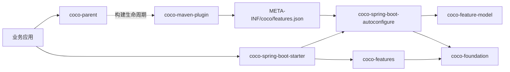

## 仓库架构

<table>
  <thead>
    <tr>
      <th width="20%">外层目录</th>
      <th width="47%">发布制品</th>
      <th width="33%">职责</th>
    </tr>
  </thead>
  <tbody>
    <tr>
      <td><code>coco-build</code></td>
      <td><code>coco-dependencies</code>、<code>coco-parent</code>、<code>coco-maven-plugin</code></td>
      <td>依赖管理和应用构建生命周期。</td>
    </tr>
    <tr>
      <td><code>coco-foundation</code></td>
      <td><code>coco-api</code>、<code>coco-context</code>、<code>coco-i18n</code>、<code>coco-exception</code>、<code>coco-logging</code>、<code>coco-feature-model</code></td>
      <td>稳定契约，以及不承载自动配置和具体 Feature 实现的通用基础设施。</td>
    </tr>
    <tr>
      <td><code>coco-spring</code></td>
      <td><code>coco-spring-boot-autoconfigure</code>、<code>coco-spring-boot-starter</code></td>
      <td>Spring Boot 集成和单一应用入口。</td>
    </tr>
    <tr>
      <td><code>coco-features</code></td>
      <td><code>coco-web</code>、<code>coco-security</code>、<code>coco-audit</code>、<code>coco-mybatis-plus</code>、<code>coco-tenant</code>、<code>coco-data-permission</code>、<code>coco-openapi</code></td>
      <td>可独立控制的具体服务器能力。</td>
    </tr>
    <tr>
      <td><code>coco-support</code></td>
      <td><code>coco-test-support</code></td>
      <td>不承担生产运行时职责的测试支持。</td>
    </tr>
  </tbody>
</table>

进一步阅读：[框架边界](./docs/architecture/framework-boundary.md)、[完整模块布局](./docs/architecture/module-layout.md)和 [Feature 生命周期](./docs/architecture/feature-lifecycle.md)。

## 运行形态

