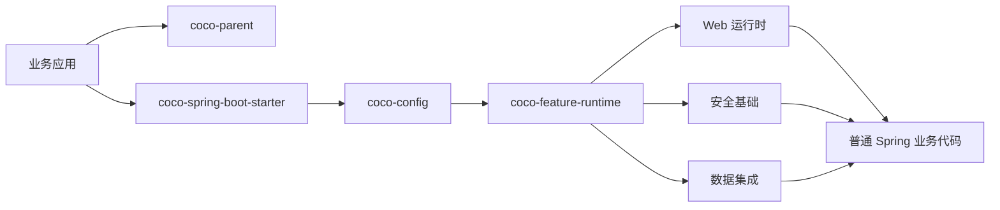

## 示例

<table>
  <thead>
    <tr>
      <th width="24%">示例</th>
      <th width="46%">验证范围</th>
      <th width="30%">入口</th>
    </tr>
  </thead>
  <tbody>
    <tr>
      <td><strong>Basic</strong></td>
      <td>无数据库场景下的统一响应、异常、i18n、Trace、签名、加密和防重放。</td>
      <td><a href="./coco-samples/coco-sample-basic/README.md">查看示例</a></td>
    </tr>
    <tr>
      <td><strong>Full</strong></td>
      <td>H2 + MyBatis-Plus，以及安全断言、租户 SQL 隔离、数据权限 SQL 过滤和审计发布。</td>
      <td><a href="./coco-samples/coco-sample-full/README.md">查看示例</a></td>
    </tr>
  </tbody>
</table>

## 运行形态

