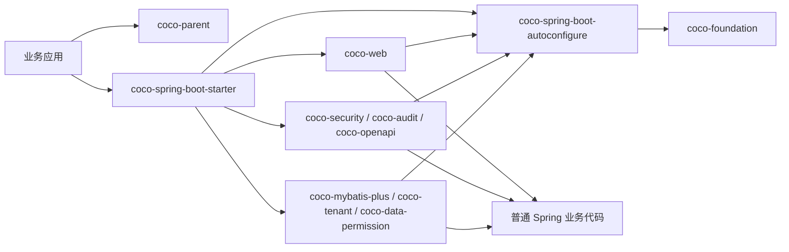

## 示例

<table>
  <thead>
    <tr>
      <th width="24%">示例</th>
      <th width="46%">验证范围</th>
      <th width="30%">入口</th>
    </tr>
  </thead>
  <tbody>
    <tr>
      <td><strong>Basic</strong></td>
      <td>无数据库场景下的统一响应、异常、i18n、Trace、签名、加密和防重放。</td>
      <td><a href="./coco-samples/coco-sample-basic/README.md">查看示例</a></td>
    </tr>
    <tr>
      <td><strong>Full</strong></td>
      <td>H2 + MyBatis-Plus，以及安全断言、租户 SQL 隔离、数据权限 SQL 过滤和审计发布。</td>
      <td><a href="./coco-samples/coco-sample-full/README.md">查看示例</a></td>
    </tr>
  </tbody>
</table>

## 运行形态

### 2.x 兼容坐标

已发布的 `coco-config`、`coco-feature-runtime`、`coco-feature-web`、`coco-feature-mybatis-plus`、`coco-feature-audit`、`coco-feature-security`、`coco-feature-tenant`、`coco-feature-data-permission`、`coco-feature-openapi` 和 `coco-test` 坐标在整个 2.x 周期内仍可解析，它们位于 `coco-build/coco-compatibility`，仅作为无源码兼容 JAR，不再拥有实现，也不是仓库内部依赖目标。新应用继续使用 `coco-spring-boot-starter`；直接依赖框架模块时，应使用 `coco-spring-boot-autoconfigure`、上图所列的 canonical `coco-*` feature 制品或 `coco-test-support`。`coco-feature-codegen` 保持不变。
