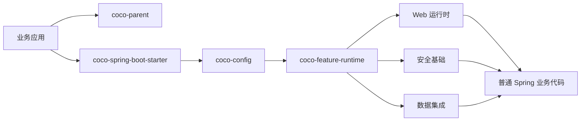

## Framework 验收

<table>
  <thead>
    <tr>
      <th width="24%">验收场景</th>
      <th width="46%">验证范围</th>
      <th width="30%">入口</th>
    </tr>
  </thead>
  <tbody>
    <tr>
      <td><strong>Basic</strong></td>
      <td>无数据库场景下的统一响应、异常、i18n、Trace、签名、加密和防重放。</td>
      <td><a href="https://github.com/patton174/coco-admin/tree/main/framework-acceptance">查看 coco-admin 验收</a></td>
    </tr>
    <tr>
      <td><strong>Full</strong></td>
      <td>H2 + MyBatis-Plus，以及安全断言、租户 SQL 隔离、数据权限 SQL 过滤和审计发布。</td>
      <td><a href="https://github.com/patton174/coco-admin/tree/main/framework-acceptance">查看 coco-admin 验收</a></td>
    </tr>
  </tbody>
</table>

> **阶段 1 清理状态：** `coco-sample-full` 和 Basic 的 `scripts/verify_business_flow.py` 已删除。保留的 Basic README、POM、Postman 资产、源码测试和仍有效的辅助脚本是临时 2.x 迁移遗留，不是 reactor 模块，也不会被 CI、发布或框架验收调用。其物理删除留待阶段 2；等价的 Basic/Full 验收由 `coco-admin/framework-acceptance` 维护。

## 运行形态

```mermaid
flowchart LR
    app["业务应用"] --> parent["coco-parent"]
    app --> starter["coco-spring-boot-starter"]
    starter --> config["coco-config"]
    config --> runtime["coco-feature-runtime"]
    runtime --> web["Web 运行时"]
    runtime --> security["安全基础"]
    runtime --> data["数据集成"]
    web --> business["普通 Spring 业务代码"]
    security --> business
    data --> business
```
