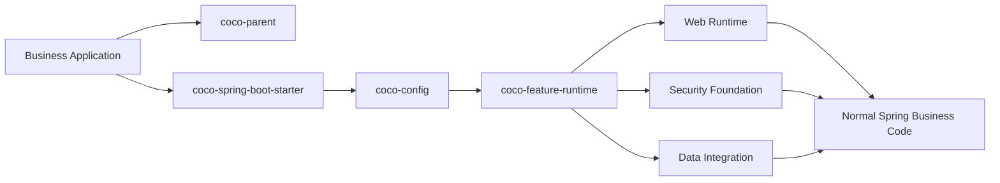

<div align="center">

# Coco Framework

<p>
  <strong>A high-convention Spring Boot Web server framework for fast, production-ready Java services.</strong>
</p>

<p>
  <a href="./README.md">English</a>
  ·
  <a href="./README_CN.md">简体中文</a>
</p>

<p>
  
  
  
  
</p>

<p>
  <a href="#install">Install</a>
  ·
  <a href="#what-coco-provides">Capabilities</a>
  ·
  <a href="#production-sql-guard">SQL Guard</a>
  ·
  <a href="#boundary">Boundary</a>
  ·
  <a href="#extension-boundaries">Extension Boundaries</a>
  ·
  <a href="#samples">Samples</a>
  ·
  <a href="#stars">Stars</a>
  ·
  <a href="#contributors">Contributors</a>
</p>

</div>

---

## Overview

Coco Framework helps teams build Spring Boot Web servers with a strong black-box infrastructure foundation and a normal Java/Spring business programming model.

The framework is designed for SaaS systems, internal services, admin APIs, integration servers, and general Web applications. It is not a zero-code business runtime and does not force one user, role, menu, organization, or tenant model onto every project.

> Infrastructure defaults are automatic. Business code is explicit, generated, or user-owned.

## Install

Use `coco-parent` as the application parent and add the single starter dependency.

```xml
<parent>
    <groupId>io.github.patton174</groupId>
    <artifactId>coco-parent</artifactId>
    <version>${coco.version}</version>
    <relativePath/>
</parent>

<dependencies>
    <dependency>
        <groupId>io.github.patton174</groupId>
        <artifactId>coco-spring-boot-starter</artifactId>
    </dependency>
</dependencies>
```

Optional feature selection remains declarative:

```yaml
coco:
  features:
    disabled:
      - mybatis-plus
      - tenant
      - data-permission
```

Or Java-based:

```java
@CocoFeatures(disabled = {
        CocoFeature.TENANT,
        CocoFeature.DATA_PERMISSION
})
@Configuration(proxyBeanMethods = false)
class ApplicationCocoConfiguration {
}
```

Prefer YAML or `@CocoFeatures` for feature selection. The older `CocoConfigurer` Java hook is kept for compatibility but is deprecated.

Business controllers remain ordinary Spring code:

```java
@RestController
@RequestMapping("/orders")
class OrderController {

    private final OrderService orderService;

    OrderController(OrderService orderService) {
        this.orderService = orderService;
    }

    @PostMapping
    OrderResponse create(@RequestBody CreateOrderRequest request) {
        return this.orderService.create(request);
    }
}
```

## Explicit CRUD Source Generation

When a project needs standard CRUD scaffolding, add `coco-codegen.yml` at its root:

```yaml
base-package: com.example.catalog
resources:
  - name: Product
    table: catalog_product
    api-path: /products
    id: { name: id, column: id, type: Long, strategy: AUTO }
    fields:
      - { name: sku, column: sku, type: String, required: true }
      - { name: unitPrice, column: unit_price, type: BigDecimal, required: true }
```

Run the opt-in goal:

```powershell
mvn coco:generate
```

The generator writes to `src/main/java` by default and refuses to overwrite existing files. It produces ordinary Controller, DTO, application-service, domain-repository, and MyBatis-Plus infrastructure source owned by the business project. The goal is not bound to the build lifecycle and never exposes entities automatically at runtime.

## Production SQL Guard

Coco keeps MyBatis-Plus SQL guard disabled by default so first adoption does not break existing maintenance SQL. For production services, replay or review application SQL first, then enable the guard explicitly:

```yaml
coco:
  mybatis-plus:
    sql-guard:
      block-attack-enabled: true
      illegal-sql-enabled: true
```

When enabled, MyBatis-Plus may reject legitimate SQL that should be rewritten, reviewed, or explicitly ignored only for controlled maintenance statements:

- `UPDATE` or `DELETE` without a selective `WHERE`, or with tautological conditions such as `1 = 1`.
- `SELECT`, `UPDATE`, or `DELETE` without `WHERE` when `IllegalSQLInnerInterceptor` is enabled.
- predicates using `OR`, `!=`, functions on the checked column side, or parser-detected subquery patterns.
- predicates or join conditions whose first checked column is not covered by index metadata.
- complex join, schema-qualified, vendor-specific, or dynamically generated SQL that the JSQLParser-based guard cannot validate reliably.

## What Coco Provides

<table>
  <tr>
    <td width="33%">
      <p></p>
      <strong>Web Runtime</strong><br/>
      Unified responses, exception responses, trace headers, request context, access logs, request signatures, encryption, and replay protection.
    </td>
    <td width="33%">
      <p></p>
      <strong>Security Foundation</strong><br/>
      Principal context facade, resolver SPI, Web context bridge, trusted-header adapter, assertions, and propagation helpers.
    </td>
    <td width="33%">
      <p></p>
      <strong>Data Integration</strong><br/>
      MyBatis-Plus interceptor assembly, pagination, SQL guard, tenant SQL isolation, and data-permission SQL predicates.
    </td>
  </tr>
  <tr>
    <td width="33%">
      <p></p>
      <strong>Feature Control</strong><br/>
      Parent POM, BOM, one starter, declarative feature selection, dependency-aware feature plans, and runtime feature conditions.
    </td>
    <td width="33%">
      <p></p>
      <strong>Audit Pipeline</strong><br/>
      Audit event model, recorder SPI, publisher, failure policy, and access-log-to-audit adapter.
    </td>
    <td width="33%">
      <p></p>
      <strong>Explicit Source Generation</strong><br/>
      Replaceable templates, built-in CRUD source scaffolding, and safe writes. Hidden runtime CRUD controllers remain out of scope.
    </td>
  </tr>
</table>

## Boundary

<table>
  <thead>
    <tr>
      <th width="50%">Coco Encapsulates</th>
      <th width="50%">Application Owns</th>
    </tr>
  </thead>
  <tbody>
    <tr>
      <td>Starter wiring and auto-configuration composition</td>
      <td>Domain model and API semantics</td>
    </tr>
    <tr>
      <td>Feature activation, dependency propagation, and runtime feature gating</td>
      <td>Controller shape and service orchestration</td>
    </tr>
    <tr>
      <td>Unified response, typed exceptions, i18n, trace context, and access logs</td>
      <td>Transaction boundaries and custom persistence decisions</td>
    </tr>
    <tr>
      <td>Request signatures, encryption, replay protection, security context lifecycle bridge, audit hooks, tenant SQL, and data-permission SQL</td>
      <td>Authentication provider, user model, organization model, role model, and generated CRUD code</td>
    </tr>
  </tbody>
</table>

CRUD belongs to code generation, not runtime entity exposure. Generated code should be readable Java source that the business project can keep, edit, delete, or replace.

## Extension Boundaries

<table>
  <thead>
    <tr>
      <th width="25%">Area</th>
      <th width="38%">Delivered Boundary</th>
      <th width="37%">Application or Roadmap</th>
    </tr>
  </thead>
  <tbody>
    <tr>
      <td>Security</td>
      <td>Context facade, resolver SPI, Servlet context bridge, trusted-header adapter, assertions, and propagation primitives.</td>
      <td>Authentication provider, RBAC/ABAC model, sessions, tokens, and user storage.</td>
    </tr>
    <tr>
      <td>Audit</td>
      <td>Event contract, publisher, recorder SPI, failure policy, and access-log adapter.</td>
      <td>Database persistence, MQ delivery, compliance reports, and retention policy.</td>
    </tr>
    <tr>
      <td>OpenAPI</td>
      <td>Metadata provider, configuration boundary, and optional SpringDoc metadata customizer when SpringDoc is already on the application classpath.</td>
      <td>Document renderer, UI integration, and endpoint-specific documentation strategy.</td>
    </tr>
    <tr>
      <td>Codegen</td>
      <td>Generator SPI, built-in CRUD templates, an explicit Maven goal, overwrite protection, and custom template locations.</td>
      <td>Project-specific templates, business rules, and ongoing ownership of generated CRUD source.</td>
    </tr>
  </tbody>
</table>

## Samples

<table>
  <thead>
    <tr>
      <th width="24%">Sample</th>
      <th width="46%">What It Proves</th>
      <th width="30%">Entry</th>
    </tr>
  </thead>
  <tbody>
    <tr>
      <td><strong>Basic</strong></td>
      <td>Web responses, exceptions, i18n, trace, signatures, encryption, and replay protection without a database.</td>
      <td><a href="./coco-samples/coco-sample-basic/README.md">Open sample</a></td>
    </tr>
    <tr>
      <td><strong>Full</strong></td>
      <td>H2 + MyBatis-Plus with security assertions, tenant SQL isolation, data-permission SQL filtering, and audit publication.</td>
      <td><a href="./coco-samples/coco-sample-full/README.md">Open sample</a></td>
    </tr>
  </tbody>
</table>

## Runtime Shape



## Star History

<!-- COCO_STATS_START -->
<table>
  <tr>
    <td align="center"><strong>1</strong><br/>Stars</td>
    <td align="center"><strong>0</strong><br/>Forks</td>
    <td align="center"><strong>1</strong><br/>Contributors</td>
    <td align="center"><a href="https://github.com/patton174/coco-framework">Updated: 2026-07-10</a></td>
  </tr>
</table>
<!-- COCO_STATS_END -->

<a href="https://www.star-history.com/?repos=patton174%2Fcoco-framework&type=date&legend=bottom-right">
  <picture>
    <source media="(prefers-color-scheme: dark)" srcset="https://api.star-history.com/chart?repos=patton174/coco-framework&type=date&theme=dark&legend=bottom-right&sealed_token=WZtqAVEpmYHgLl3AUpfxFV4e_emJFt7fNK_ep9JrVVZ-tZvSoWbTwOEfvg8WIg0WEiosjWjZYSnF9DgC86cCiKp4iJ1uqirVm49z4-xECDHKRBogVqDokZF1cp6b00IInXU9FOcrhqR1nhcwP0t2KQhtRQAFe07t-K4PpUO7ERUjlhS6iRI1085j31pQ"/>
    <source media="(prefers-color-scheme: light)" srcset="https://api.star-history.com/chart?repos=patton174/coco-framework&type=date&legend=bottom-right&sealed_token=WZtqAVEpmYHgLl3AUpfxFV4e_emJFt7fNK_ep9JrVVZ-tZvSoWbTwOEfvg8WIg0WEiosjWjZYSnF9DgC86cCiKp4iJ1uqirVm49z4-xECDHKRBogVqDokZF1cp6b00IInXU9FOcrhqR1nhcwP0t2KQhtRQAFe07t-K4PpUO7ERUjlhS6iRI1085j31pQ"/>
    
  </picture>
</a>

## Contributors

<!-- COCO_CONTRIBUTORS_START -->
<table>
  <tr>
    <td align="center">
      <a href="https://github.com/patton174">
        <br/>
        <sub>patton174</sub>
      </a>
    </td>
  </tr>
</table>
<p><a href="https://github.com/patton174/coco-framework/graphs/contributors">View all contributors</a></p>
<!-- COCO_CONTRIBUTORS_END -->

<sub>The stars and contributors sections are refreshed by GitHub Actions. See `.github/workflows/update-readme-insights.yml` and `tools/docs/update-readme-insights.mjs`.</sub>

## License

Apache License 2.0.
