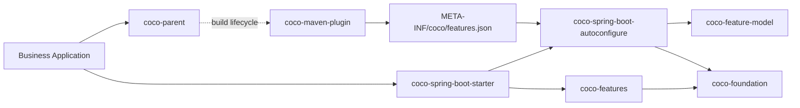

<!-- Generated from .github/readme/manifest.json. Edit the source fragments, then run: node .github/readme/scripts/render.mjs --write -->

<div align="center">

# Coco Framework

<p>
  <strong>A high-convention Spring Boot Web server framework for fast, production-ready Java services.</strong>
</p>

<p>
  <a href="./README.md">English</a>
  ·
  <a href="./README_CN.md">简体中文</a>
</p>

<p>
  
  
  
  
</p>

<p>
  <a href="#install">Install</a>
  ·
  <a href="#what-coco-provides">Capabilities</a>
  ·
  <a href="#production-sql-guard">SQL Guard</a>
  ·
  <a href="#boundary">Boundary</a>
  ·
  <a href="#extension-boundaries">Extension Boundaries</a>
  ·
  <a href="#repository-architecture">Architecture</a>
  ·
  <a href="#star-history">Stars</a>
  ·
  <a href="#contributors">Contributors</a>
</p>

</div>

---

## Overview

Coco Framework helps teams build Spring Boot Web servers with a strong black-box infrastructure foundation and a normal Java/Spring business programming model.

The framework is designed for SaaS systems, internal services, admin APIs, integration servers, and general Web applications. It is not a zero-code business runtime and does not force one user, role, menu, organization, or tenant model onto every project.

> Infrastructure defaults are automatic. Business code is explicit, generated, or user-owned.

## Install

Use `coco-parent` as the application parent and add the single starter dependency.

```xml
<parent>
    <groupId>io.github.patton174</groupId>
    <artifactId>coco-parent</artifactId>
    <version>${coco.version}</version>
    <relativePath/>
</parent>

<dependencies>
    <dependency>
        <groupId>io.github.patton174</groupId>
        <artifactId>coco-spring-boot-starter</artifactId>
    </dependency>
</dependencies>
```

Optional feature selection remains declarative:

```yaml
coco:
  features:
    disabled:
      - mybatis-plus
      - tenant
      - data-permission
```

Or Java-based:

```java
@CocoFeatures(disabled = {
        CocoFeature.TENANT,
        CocoFeature.DATA_PERMISSION
})
@Configuration(proxyBeanMethods = false)
class ApplicationCocoConfiguration {
}
```

Prefer YAML or `@CocoFeatures` for feature selection. The older `CocoConfigurer` Java hook is kept for compatibility but is deprecated.

Business controllers remain ordinary Spring code:

```java
@RestController
@RequestMapping("/orders")
class OrderController {

    private final OrderService orderService;

    OrderController(OrderService orderService) {
        this.orderService = orderService;
    }

    @PostMapping
    OrderResponse create(@RequestBody CreateOrderRequest request) {
        return this.orderService.create(request);
    }
}
```

Source scaffolding is a development-time ecosystem concern. Use [coco-generate](https://github.com/patton174/coco-generate) when a project needs generated application source; the Framework starter and Maven plugin do not ship a generator or expose entities as runtime CRUD APIs.

## Production SQL Guard

Coco keeps MyBatis-Plus SQL guard disabled by default so first adoption does not break existing maintenance SQL. For production services, replay or review application SQL first, then enable the guard explicitly:

```yaml
coco:
  mybatis-plus:
    sql-guard:
      block-attack-enabled: true
      illegal-sql-enabled: true
```

When enabled, MyBatis-Plus may reject legitimate SQL that should be rewritten, reviewed, or explicitly ignored only for controlled maintenance statements:

- `UPDATE` or `DELETE` without a selective `WHERE`, or with tautological conditions such as `1 = 1`.
- `SELECT`, `UPDATE`, or `DELETE` without `WHERE` when `IllegalSQLInnerInterceptor` is enabled.
- predicates using `OR`, `!=`, functions on the checked column side, or parser-detected subquery patterns.
- predicates or join conditions whose first checked column is not covered by index metadata.
- complex join, schema-qualified, vendor-specific, or dynamically generated SQL that the JSQLParser-based guard cannot validate reliably.

## Cluster Replay Protection

The default `InMemoryCocoReplayStore` is intentionally process-local. It is suitable for one application instance and local development, but clustered services must use a shared store. When the application already provides Spring `JdbcOperations`, select the built-in JDBC reference implementation explicitly:

```yaml
coco:
  web:
    replay:
      store-type: jdbc
      jdbc:
        table-name: coco_replay_key
```

Coco does not execute database migrations. Create the equivalent structure through the application's existing migration process, adapting this baseline DDL to the selected database:

```sql
CREATE TABLE coco_replay_key (
    replay_key_hash VARCHAR(64) NOT NULL,
    expires_at_epoch_millis BIGINT NOT NULL,
    PRIMARY KEY (replay_key_hash)
);
CREATE INDEX idx_coco_replay_key_expires_at
    ON coco_replay_key (expires_at_epoch_millis);
```

The unique key provides cross-instance atomic reservation, while Coco stores only a SHA-256 digest and cleans expired rows in the background. Reservation-path database failures fail protected requests closed; asynchronous cleanup failures are logged and retried. The Servlet filter reserves before normal Controller transaction boundaries. Schema lifecycle, database availability, clock synchronization, direct-call transaction use, and exactly-once side effects remain application responsibilities. With multiple `JdbcOperations` Beans, mark the intended candidate `@Primary` or provide a custom `CocoReplayStore`, which still replaces both built-in stores.

## Async Logging Backpressure

Coco logging uses a bounded asynchronous queue by default. `ERROR` records and records carrying an exception are always written synchronously; when the queue is full, `WARN` also falls back to synchronous output. Rejected `TRACE`, `DEBUG`, and `INFO` records remain intentionally droppable so queue submission never waits for capacity.

Every actual drop increments an in-process counter, while each non-reentrant drop notifies `CocoAsyncLogDropListener`. The default listener writes a direct SLF4J warning for the first drop and then at power-of-two totals, providing a low-noise overload signal without feeding diagnostics back into the full Coco queue. Applications can replace it with one Bean:

```java
@Bean
CocoAsyncLogDropListener cocoAsyncLogDropListener(MeterRegistry registry) {
    Counter counter = registry.counter("coco.logging.async.dropped");
    return (level, handleName, totalDropped) -> counter.increment();
}
```

The callback receives only the level, log handle name, and cumulative count; message text and exceptions are not exposed. It runs on the submitting thread and must remain fast and avoid blocking. Concurrent callbacks receive unique cumulative values but are not ordered across threads; listener re-entry is suppressed while nested drops are still counted. This mechanism is overload observability, not durable log delivery; applications requiring delivery guarantees should provide their own `CocoLogSink` or audit recorder.

## What Coco Provides

<table>
  <tr>
    <td width="33%">
      <p></p>
      <strong>Web Runtime</strong><br/>
      Unified responses, exception responses, trace headers, request context, access logs, request signatures, encryption, and process-local or shared JDBC replay protection.
    </td>
    <td width="33%">
      <p></p>
      <strong>Security Foundation</strong><br/>
      Principal context facade, resolver SPI, Web context bridge, trusted-header adapter, assertions, and propagation helpers.
    </td>
    <td width="33%">
      <p></p>
      <strong>Data Integration</strong><br/>
      MyBatis-Plus interceptor assembly, pagination, SQL guard, tenant SQL isolation, and data-permission SQL predicates.
    </td>
  </tr>
  <tr>
    <td width="33%">
      <p></p>
      <strong>Feature Control</strong><br/>
      Parent POM, <code>coco-dependencies</code> BOM, one starter, declarative feature selection, dependency-aware feature plans, and runtime feature conditions.
    </td>
    <td width="33%">
      <p></p>
      <strong>Audit Pipeline</strong><br/>
      Structured audit logging by default, plus formatter and recorder SPI, publisher, failure policy, and access-log adaptation.
    </td>
    <td width="33%">
      <p></p>
      <strong>Build Integrity</strong><br/>
      One feature model drives dependency composition, the packaged manifest, runtime conditions, and pruning of disabled artifacts.
    </td>
  </tr>
</table>

## Boundary

<table>
  <thead>
    <tr>
      <th width="50%">Coco Encapsulates</th>
      <th width="50%">Application Owns</th>
    </tr>
  </thead>
  <tbody>
    <tr>
      <td>Starter wiring and auto-configuration composition</td>
      <td>Domain model and API semantics</td>
    </tr>
    <tr>
      <td>Feature activation, dependency propagation, and runtime feature gating</td>
      <td>Controller shape and service orchestration</td>
    </tr>
    <tr>
      <td>Unified response, typed exceptions, i18n, trace context, and access logs</td>
      <td>Transaction boundaries and custom persistence decisions</td>
    </tr>
    <tr>
      <td>Request signatures, encryption, replay protection, security context lifecycle bridge, audit hooks, tenant SQL, and data-permission SQL</td>
      <td>Authentication provider, user model, organization model, role model, and generated CRUD code</td>
    </tr>
  </tbody>
</table>

Coco never exposes entities as runtime CRUD APIs. Application source remains owned by the business project; teams that need development-time scaffolding use the separate [coco-generate](https://github.com/patton174/coco-generate) project.

## Extension Boundaries

<table>
  <thead>
    <tr>
      <th width="25%">Area</th>
      <th width="38%">Delivered Boundary</th>
      <th width="37%">Application or Roadmap</th>
    </tr>
  </thead>
  <tbody>
    <tr>
      <td>Replay</td>
      <td>Process-local default, explicit shared JDBC reference store, atomic key reservation, expiry cleanup, and replaceable store SPI.</td>
      <td>Database migration and availability, cluster clock synchronization, business transactions, and exactly-once semantics.</td>
    </tr>
    <tr>
      <td>Security</td>
      <td>Context facade, resolver SPI, Servlet context bridge, trusted-header adapter, assertions, and propagation primitives.</td>
      <td>Authentication provider, RBAC/ABAC model, sessions, tokens, and user storage.</td>
    </tr>
    <tr>
      <td>Audit</td>
      <td>Event contract, publisher, default best-effort structured logging, formatter and recorder SPI, failure policy, and access-log adapter.</td>
      <td>Database persistence, MQ delivery, compliance reports, and retention policy.</td>
    </tr>
    <tr>
      <td>OpenAPI</td>
      <td>Metadata provider, configuration boundary, and optional SpringDoc metadata customizer when SpringDoc is already on the application classpath.</td>
      <td>Document renderer, UI integration, and endpoint-specific documentation strategy.</td>
    </tr>
    <tr>
      <td>Source generation</td>
      <td>Outside the Framework runtime and Maven plugin; <a href="https://github.com/patton174/coco-generate">coco-generate</a> owns generator APIs and templates.</td>
      <td>Project-specific templates, business rules, review, and ongoing ownership of generated source.</td>
    </tr>
  </tbody>
</table>

## Repository Architecture

<table>
  <thead>
    <tr>
      <th width="20%">Outer Directory</th>
      <th width="47%">Published Artifacts</th>
      <th width="33%">Responsibility</th>
    </tr>
  </thead>
  <tbody>
    <tr>
      <td><code>coco-build</code></td>
      <td><code>coco-dependencies</code>, <code>coco-parent</code>, <code>coco-maven-plugin</code></td>
      <td>Dependency management and application build lifecycle.</td>
    </tr>
    <tr>
      <td><code>coco-foundation</code></td>
      <td><code>coco-api</code>, <code>coco-context</code>, <code>coco-i18n</code>, <code>coco-exception</code>, <code>coco-logging</code>, <code>coco-feature-model</code></td>
      <td>Stable contracts and reusable infrastructure without auto-configuration or concrete feature ownership.</td>
    </tr>
    <tr>
      <td><code>coco-spring</code></td>
      <td><code>coco-spring-boot-autoconfigure</code>, <code>coco-spring-boot-starter</code></td>
      <td>Spring Boot integration and the single application entry point.</td>
    </tr>
    <tr>
      <td><code>coco-features</code></td>
      <td><code>coco-web</code>, <code>coco-security</code>, <code>coco-audit</code>, <code>coco-mybatis-plus</code>, <code>coco-tenant</code>, <code>coco-data-permission</code>, <code>coco-openapi</code></td>
      <td>Concrete, independently controlled server capabilities.</td>
    </tr>
    <tr>
      <td><code>coco-support</code></td>
      <td><code>coco-test-support</code></td>
      <td>Test support without production runtime ownership.</td>
    </tr>
  </tbody>
</table>

See [framework boundaries](./docs/architecture/framework-boundary.md), the [complete module layout](./docs/architecture/module-layout.md), and the [feature lifecycle](./docs/architecture/feature-lifecycle.md).

## Runtime Shape



## Coco Ecosystem

<table>
  <thead>
    <tr>
      <th width="24%">Project</th>
      <th width="46%">Responsibility</th>
      <th width="30%">Repository</th>
    </tr>
  </thead>
  <tbody>
    <tr>
      <td><strong>Coco Framework</strong></td>
      <td>Independent Spring Boot Web server infrastructure and stable extension boundaries.</td>
      <td><a href="https://github.com/patton174/coco-framework">coco-framework</a></td>
    </tr>
    <tr>
      <td><strong>Coco Admin</strong></td>
      <td>ERP product and business modules built with normal application code on top of the framework.</td>
      <td><a href="https://github.com/patton174/coco-admin">coco-admin</a></td>
    </tr>
    <tr>
      <td><strong>Coco Generate</strong></td>
      <td>Development-time source generation, reusable template packs, and safe generated-file ownership.</td>
      <td><a href="https://github.com/patton174/coco-generate">coco-generate</a></td>
    </tr>
  </tbody>
</table>

The dependency direction is intentionally one-way: Admin depends on Framework at runtime and may use Generate during development; Generate may target Framework contracts; Framework never depends on either product repository. Generated source belongs to the consuming application and does not add a runtime dependency on Generate.

## Star History

<!-- COCO_STATS_START -->
<table>
  <tr>
    <td align="center"><strong>1</strong><br/>Stars</td>
    <td align="center"><strong>0</strong><br/>Forks</td>
    <td align="center"><strong>1</strong><br/>Contributors</td>
    <td align="center"><a href="https://github.com/patton174/coco-framework">Updated: 2026-07-11</a></td>
  </tr>
</table>
<!-- COCO_STATS_END -->

<a href="https://www.star-history.com/?repos=patton174%2Fcoco-framework&type=date&legend=bottom-right">
  <picture>
    <source media="(prefers-color-scheme: dark)" srcset="https://api.star-history.com/chart?repos=patton174/coco-framework&type=date&theme=dark&legend=bottom-right&sealed_token=WZtqAVEpmYHgLl3AUpfxFV4e_emJFt7fNK_ep9JrVVZ-tZvSoWbTwOEfvg8WIg0WEiosjWjZYSnF9DgC86cCiKp4iJ1uqirVm49z4-xECDHKRBogVqDokZF1cp6b00IInXU9FOcrhqR1nhcwP0t2KQhtRQAFe07t-K4PpUO7ERUjlhS6iRI1085j31pQ"/>
    <source media="(prefers-color-scheme: light)" srcset="https://api.star-history.com/chart?repos=patton174/coco-framework&type=date&legend=bottom-right&sealed_token=WZtqAVEpmYHgLl3AUpfxFV4e_emJFt7fNK_ep9JrVVZ-tZvSoWbTwOEfvg8WIg0WEiosjWjZYSnF9DgC86cCiKp4iJ1uqirVm49z4-xECDHKRBogVqDokZF1cp6b00IInXU9FOcrhqR1nhcwP0t2KQhtRQAFe07t-K4PpUO7ERUjlhS6iRI1085j31pQ"/>
    
  </picture>
</a>

## Contributors

<!-- COCO_CONTRIBUTORS_START -->
<table>
  <tr>
    <td align="center">
      <a href="https://github.com/patton174">
        <br/>
        <sub>patton174</sub>
      </a>
    </td>
  </tr>
</table>
<p><a href="https://github.com/patton174/coco-framework/graphs/contributors">View all contributors</a></p>
<!-- COCO_CONTRIBUTORS_END -->

<sub>The stars and contributors sections are refreshed by the README maintenance workflow. See `.github/workflows/readme-maintenance.yml` and `.github/readme/scripts/update-insights.mjs`.</sub>

## License

Apache License 2.0.
