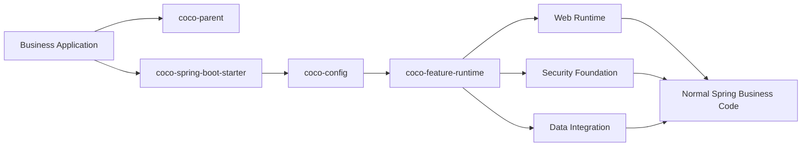

<!-- Generated from .github/readme/manifest.json. Edit the source fragments, then run: node .github/readme/scripts/render.mjs --write -->

<div align="center">


# Coco Framework

**Less infrastructure. More product.**

Spring Boot · One starter · Plain Java

[English](README.md) · [简体中文](README_CN.md)

     

[**Start building →**](https://cocoframwork.dev/en/getting-started) · [Documentation](https://cocoframwork.dev/en/) · [GitHub Discussions](https://github.com/patton174/coco-framework/discussions)

</div>

---

## Why Coco

Every product has its own domain. Much of the setup can be shared.

| Work you may be repeating | What Coco provides |
|---|---|
| Copying response, exception and logging code | Starter integration for response wrapping, global exceptions and TraceId |
| Managing growing configuration | YAML / annotation feature selection with a consistent build and runtime plan |
| Moving from one instance to many | Replaceable rate-limit, idempotency and lock stores; explicitly configure Redis or other services |
| Adapting your domain to a framework | Ordinary Spring controllers; you own authentication, organizations and transactions |

| **17** feature IDs on main | **1** starter | **Java 17+** | **Apache-2.0** |
|---|---|---|---|
| Includes Codegen compatibility | With parent / BOM | Application compile target | Open-source license |

> Latest stable: **v2.0.2**. This README describes main; new cache, notification and captcha capabilities are not all in the stable release. External services and multi-instance stores need explicit configuration; not every feature works without setup.

## Less assembly to maintain

**Manual assembly:** illustrative responsibilities, not a runnable example.

```java
@Configuration
class WebInfrastructure {
    // ResponseBodyAdvice: response consistency
    // RestControllerAdvice: exception handling
    // TraceId filter: request correlation
    // Access-log filter: request logging
    // Context propagation: asynchronous work
}
```

**With Coco:** use the parent and one starter below. The framework handles those integration points; business code stays ordinary Java / Spring.

## Choosing an approach

| Dimension | Assemble with Spring Boot | Coco Framework |
|---|---|---|
| Default behavior | Compose response, exception and logging conventions | Response wrapping, exceptions and TraceId connected by default |
| Capabilities | Select and integrate ecosystem libraries | Combine infrastructure with feature switches |
| Extensions | Spring beans and extension interfaces | Spring extension points plus focused SPIs |
| Business model | Design your own | Design your own users, roles and organizations |
| Engineering governance | Establish your team's workflow | Repository CI, Agent review and protected merges |

Choose based on dependencies, domain boundaries and deployment needs. This compares integration approaches, not benchmark results.

---

## Install

Use `coco-parent` as the application parent and add the single starter dependency.

```xml
<parent>
    <groupId>io.github.patton174</groupId>
    <artifactId>coco-parent</artifactId>
    <version>2.0.2</version>
    <relativePath/>
</parent>

<dependencies>
    <dependency>
        <groupId>io.github.patton174</groupId>
        <artifactId>coco-spring-boot-starter</artifactId>
    </dependency>
</dependencies>
```

That is the whole setup. Unified responses, global exception handling, and TraceId propagation are on by default; business controllers stay ordinary Spring code.

Capabilities are selected declaratively, in YAML or with `@CocoFeatures`:

```yaml
coco:
  features:
    disabled:
      - mybatis-plus
      - tenant
```

**→ [Getting started](https://cocoframwork.dev/en/getting-started)** walks through a first service end to end.
**→ [Feature toggles](https://cocoframwork.dev/en/feature-toggles)** lists every switch and its default.

## CRUD source generation

Standard CRUD scaffolding lives in the standalone [coco-generate](https://github.com/patton174/coco-generate) tool. It generates business-owned ordinary source during development — Controller, DTO, application service, domain repository, MyBatis-Plus infrastructure — and is not an application runtime dependency. It writes to `src/main/java` and refuses to overwrite existing files, so entities are never exposed automatically at runtime.

**→ [Code generation](https://cocoframwork.dev/en/features/codegen)** covers the config format and templates.

## Production notes

A few defaults are deliberately conservative, because the safe choice for a first adoption is not the right choice for a cluster. Each is off or process-local until you opt in:

| Concern | Default | For production |
|---------|---------|----------------|
| **SQL guard** | Disabled, so existing maintenance SQL keeps working | Review your SQL, then enable `block-attack` / `illegal-sql` — the guard may reject legitimate statements it cannot validate |
| **Replay protection** | `InMemoryCocoReplayStore`, process-local | Switch to the JDBC store (or your own) so reservations are atomic across instances. Coco runs no migrations — you own the schema |
| **Async logging** | Bounded queue; `ERROR` and exceptions always synchronous | Replace `CocoAsyncLogDropListener` to feed drop counts into your metrics. This is overload observability, not durable delivery |

**→ [SQL guard](https://cocoframwork.dev/en/features/mybatis-plus)** · **[Replay protection](https://cocoframwork.dev/en/features/request-security)** · **[Logging and infrastructure](https://cocoframwork.dev/en/features/infra)**

## Capabilities

<table>
  <tr>
    <td width="33%"><strong>🌐 Consistent web requests</strong><p>Give every endpoint consistent behavior.</p><ul><li>Responses and exceptions</li><li>TraceId and access logs</li><li>Signatures, encryption and replay protection</li></ul></td>
    <td width="33%"><strong>🗃 Data and permissions</strong><p>Integrate isolation into the query path.</p><ul><li>MyBatis-Plus and pagination</li><li>Tenant SQL isolation</li><li>Data-permission conditions</li></ul></td>
    <td width="33%"><strong>⏱ Traffic and reliability</strong><p>Put boundaries around frequent and repeated requests.</p><ul><li>Rate limiting and idempotency</li><li>Locks and scheduling</li><li>Replaceable stores</li></ul></td>
  </tr>
  <tr>
    <td width="33%"><strong>📦 Files and platform</strong><p>Let shared services grow with the application.</p><ul><li>Files and cache</li><li>Messaging and notifications</li><li>Captcha</li></ul></td>
    <td width="33%"><strong>🔎 Audit and visibility</strong><p>Leave useful evidence of important actions.</p><ul><li>Structured audit events</li><li>Logs and context</li><li>OpenAPI metadata</li></ul></td>
    <td width="33%"><strong>🧩 Features and extensions</strong><p>Ship the capabilities you need.</p><ul><li>Declarative feature selection</li><li>Build-time pruning</li><li>Bean and SPI overrides</li></ul></td>
  </tr>
</table>

## Boundary

Coco owns **infrastructure**. Your application owns the **domain model, API semantics, authentication provider, and user/role/organization models**.

Use Spring beans and the documented extension interfaces to replace integrations. CRUD generation produces ordinary Java source that your application owns; it does not expose entities as APIs at runtime.

**→ [Boundary and design philosophy](https://cocoframwork.dev/en/overview)** — responsibilities and scope.

## Framework Acceptance

<table>
  <thead>
    <tr>
      <th width="24%">Acceptance Scenario</th>
      <th width="46%">What It Proves</th>
      <th width="30%">Entry</th>
    </tr>
  </thead>
  <tbody>
    <tr>
      <td><strong>Basic</strong></td>
      <td>Web responses, exceptions, i18n, trace, signatures, encryption, and replay protection without a database.</td>
      <td><a href="https://github.com/patton174/coco-admin/tree/main/framework-acceptance">Open coco-admin acceptance</a></td>
    </tr>
    <tr>
      <td><strong>Full</strong></td>
      <td>H2 + MyBatis-Plus with security assertions, tenant SQL isolation, data-permission SQL filtering, and audit publication.</td>
      <td><a href="https://github.com/patton174/coco-admin/tree/main/framework-acceptance">Open coco-admin acceptance</a></td>
    </tr>
  </tbody>
</table>

> **Framework acceptance:** Business and HTTP acceptance is maintained in `coco-admin/framework-acceptance`. Coco Framework no longer maintains business samples; new source generation belongs to `coco-generate`.

## Runtime Shape


```mermaid
flowchart LR
    app["Business Application"] --> parent["coco-parent"]
    app --> starter["coco-spring-boot-starter"]
    starter --> config["coco-config"]
    config --> runtime["coco-feature-runtime"]
    runtime --> web["Web Runtime"]
    runtime --> security["Security Foundation"]
    runtime --> data["Data Integration"]
    web --> business["Normal Spring Business Code"]
    security --> business
    data --> business
```

## Coco Ecosystem

<table>
  <thead>
    <tr>
      <th width="24%">Project</th>
      <th width="46%">Responsibility</th>
      <th width="30%">Repository</th>
    </tr>
  </thead>
  <tbody>
    <tr>
      <td><strong>Coco Framework</strong></td>
      <td>Independent Spring Boot Web server infrastructure and stable extension boundaries.</td>
      <td><a href="https://github.com/patton174/coco-framework">coco-framework</a></td>
    </tr>
    <tr>
      <td><strong>Coco Admin</strong></td>
      <td>ERP product and business modules built with normal application code on top of the framework.</td>
      <td><a href="https://github.com/patton174/coco-admin">coco-admin</a></td>
    </tr>
    <tr>
      <td><strong>Coco Generate</strong></td>
      <td>Development-time source generation, reusable template packs, and safe generated-file ownership.</td>
      <td><a href="https://github.com/patton174/coco-generate">coco-generate</a></td>
    </tr>
  </tbody>
</table>

The dependency direction is intentionally one-way: Admin depends on Framework at runtime and may use Generate during development; Generate may target Framework contracts; Framework never depends on either product repository. Generated source belongs to the consuming application and does not add a runtime dependency on Generate.

## Community

<table>
  <tr>
    <td><a href="https://github.com/patton174/coco-framework/blob/main/CONTRIBUTING.md"><strong>Contributing</strong></a><br/><sub>Development workflow and review expectations</sub></td>
    <td><a href="https://github.com/patton174/coco-framework/discussions"><strong>Discussions</strong></a><br/><sub>Questions, ideas, and implementation guidance</sub></td>
    <td><a href="https://github.com/patton174/coco-framework/security/policy"><strong>Security</strong></a><br/><sub>Supported versions and private reporting</sub></td>
    <td><a href="https://github.com/patton174/coco-framework/blob/main/GOVERNANCE.md"><strong>Governance</strong></a><br/><sub>Ownership, decisions, and protected merge controls</sub></td>
  </tr>
</table>

## Star History

<!-- COCO_STATS_START -->
<table>
  <tr>
    <td align="center"><strong>1</strong><br/>Stars</td>
    <td align="center"><strong>1</strong><br/>Forks</td>
    <td align="center"><strong>1</strong><br/>Contributors</td>
    <td align="center"><a href="https://github.com/patton174/coco-framework">Updated: 2026-08-31</a></td>
  </tr>
</table>
<!-- COCO_STATS_END -->

<a href="https://www.star-history.com/?repos=patton174%2Fcoco-framework&type=date&legend=bottom-right">
  <picture>
    <source media="(prefers-color-scheme: dark)" srcset="https://api.star-history.com/chart?repos=patton174/coco-framework&type=date&theme=dark&legend=bottom-right&sealed_token=WZtqAVEpmYHgLl3AUpfxFV4e_emJFt7fNK_ep9JrVVZ-tZvSoWbTwOEfvg8WIg0WEiosjWjZYSnF9DgC86cCiKp4iJ1uqirVm49z4-xECDHKRBogVqDokZF1cp6b00IInXU9FOcrhqR1nhcwP0t2KQhtRQAFe07t-K4PpUO7ERUjlhS6iRI1085j31pQ"/>
    <source media="(prefers-color-scheme: light)" srcset="https://api.star-history.com/chart?repos=patton174/coco-framework&type=date&legend=bottom-right&sealed_token=WZtqAVEpmYHgLl3AUpfxFV4e_emJFt7fNK_ep9JrVVZ-tZvSoWbTwOEfvg8WIg0WEiosjWjZYSnF9DgC86cCiKp4iJ1uqirVm49z4-xECDHKRBogVqDokZF1cp6b00IInXU9FOcrhqR1nhcwP0t2KQhtRQAFe07t-K4PpUO7ERUjlhS6iRI1085j31pQ"/>
    
  </picture>
</a>

## Contributors

<!-- COCO_CONTRIBUTORS_START -->
<table>
  <tr>
    <td align="center">
      <a href="https://github.com/patton174">
        <br/>
        <sub>patton174</sub>
      </a>
    </td>
  </tr>
</table>
<p><a href="https://github.com/patton174/coco-framework/graphs/contributors">View all contributors</a></p>
<!-- COCO_CONTRIBUTORS_END -->

<sub>The stars and contributors sections are refreshed by the README maintenance workflow. See `.github/workflows/readme-maintenance.yml` and `.github/readme/scripts/update-insights.mjs`.</sub>

## License

Apache License 2.0.
