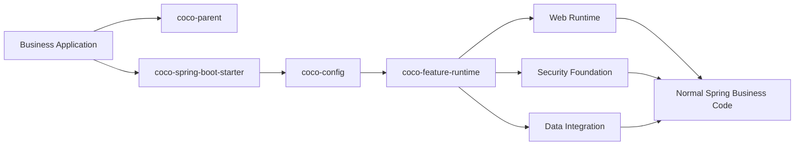

<!-- Generated from .github/readme/manifest.json. Edit the source fragments, then run: node .github/readme/scripts/render.mjs --write -->

<div align="center">

# Coco Framework

<p>
  <strong>A high-convention Spring Boot Web server framework for fast, production-ready Java services.</strong>
</p>

<p>
  <a href="./README.md">English</a>
  ·
  <a href="./README_CN.md">简体中文</a>
</p>

<p>
  
  
  
  
</p>

<p>
  <a href="https://patton174.github.io/coco-framework/"><strong>📖 Documentation</strong></a>
  ·
  <a href="https://patton174.github.io/coco-framework/getting-started">Getting started</a>
  ·
  <a href="https://patton174.github.io/coco-framework/features/web-runtime">Capabilities</a>
  ·
  <a href="https://patton174.github.io/coco-framework/skills">Agent skills</a>
</p>

<p>
  <a href="#install">Install</a>
  ·
  <a href="#what-coco-provides">What you get</a>
  ·
  <a href="#boundary">Boundary</a>
  ·
  <a href="#production-notes">Production notes</a>
  ·
  <a href="#contributors">Contributors</a>
</p>

</div>

---

## Overview

Coco Framework helps teams build Spring Boot Web servers with a strong black-box infrastructure foundation and a normal Java/Spring business programming model.

The framework is designed for SaaS systems, internal services, admin APIs, integration servers, and general Web applications. It is not a zero-code business runtime and does not force one user, role, menu, organization, or tenant model onto every project.

> Infrastructure defaults are automatic. Business code is explicit, generated, or user-owned.

## Install

Use `coco-parent` as the application parent and add the single starter dependency.

```xml
<parent>
    <groupId>io.github.patton174</groupId>
    <artifactId>coco-parent</artifactId>
    <version>${coco.version}</version>
    <relativePath/>
</parent>

<dependencies>
    <dependency>
        <groupId>io.github.patton174</groupId>
        <artifactId>coco-spring-boot-starter</artifactId>
    </dependency>
</dependencies>
```

That is the whole setup. Unified responses, global exception handling, and TraceId propagation are on by default; business controllers stay ordinary Spring code.

Capabilities are selected declaratively, in YAML or with `@CocoFeatures`:

```yaml
coco:
  features:
    disabled:
      - mybatis-plus
      - tenant
```

**→ [Getting started](https://patton174.github.io/coco-framework/getting-started)** walks through a first service end to end.
**→ [Feature toggles](https://patton174.github.io/coco-framework/feature-toggles)** lists every switch and its default.

## CRUD source generation

Standard CRUD scaffolding lives in the standalone [coco-generate](https://github.com/patton174/coco-generate) tool. It generates business-owned ordinary source during development — Controller, DTO, application service, domain repository, MyBatis-Plus infrastructure — and is not an application runtime dependency. It writes to `src/main/java` and refuses to overwrite existing files, so entities are never exposed automatically at runtime.

**→ [Code generation](https://patton174.github.io/coco-framework/features/codegen)** covers the config format and templates.

## Production notes

A few defaults are deliberately conservative, because the safe choice for a first adoption is not the right choice for a cluster. Each is off or process-local until you opt in:

| Concern | Default | For production |
|---------|---------|----------------|
| **SQL guard** | Disabled, so existing maintenance SQL keeps working | Review your SQL, then enable `block-attack` / `illegal-sql` — the guard may reject legitimate statements it cannot validate |
| **Replay protection** | `InMemoryCocoReplayStore`, process-local | Switch to the JDBC store (or your own) so reservations are atomic across instances. Coco runs no migrations — you own the schema |
| **Async logging** | Bounded queue; `ERROR` and exceptions always synchronous | Replace `CocoAsyncLogDropListener` to feed drop counts into your metrics. This is overload observability, not durable delivery |

**→ [SQL guard](https://patton174.github.io/coco-framework/features/mybatis-plus)** · **[Replay protection](https://patton174.github.io/coco-framework/features/request-security)** · **[Logging and infrastructure](https://patton174.github.io/coco-framework/features/infra)**

## What Coco Provides

<table>
  <tr>
    <td width="33%">
      <p></p>
      <strong>Web Runtime</strong><br/>
      Unified responses, exception responses, trace headers, request context, access logs, request signatures, encryption, and replay protection.
    </td>
    <td width="33%">
      <p></p>
      <strong>Security Foundation</strong><br/>
      Principal context facade, resolver SPI, Web context bridge, trusted-header adapter, assertions, and propagation helpers.
    </td>
    <td width="33%">
      <p></p>
      <strong>Data Integration</strong><br/>
      MyBatis-Plus interceptor assembly, pagination, SQL guard, tenant SQL isolation, and data-permission predicates.
    </td>
  </tr>
  <tr>
    <td width="33%">
      <p></p>
      <strong>Reliability</strong><br/>
      Rate limiting, idempotency, distributed locks, and scheduling — each with a process-local default and a replaceable store SPI.
    </td>
    <td width="33%">
      <p></p>
      <strong>Platform</strong><br/>
      Object storage SPI with content-addressed local reference implementation, structured audit pipeline, and OpenAPI metadata.
    </td>
    <td width="33%">
      <p></p>
      <strong>Feature Control</strong><br/>
      Parent POM, BOM, one starter, declarative feature selection, dependency-aware plans, and runtime feature conditions.
    </td>
  </tr>
</table>

**→ [Capability reference](https://patton174.github.io/coco-framework/features/web-runtime)** — every feature, its config keys, and its SPI.

## Boundary

Coco owns **infrastructure**. Your application owns the **domain model, API semantics, authentication provider, and user/role/organization models**.

That line is deliberate: the framework does not guess your business, it only turns the repetitive, cross-project infrastructure into replaceable black boxes. Every SPI can be overridden with a single `@Bean`.

CRUD belongs to code generation, not runtime entity exposure — generated code is readable Java source your project keeps, edits, or deletes.

**→ [Boundary and design philosophy](https://patton174.github.io/coco-framework/overview)** — what each side is responsible for, and what stays out of scope.

## Framework Acceptance

<table>
  <thead>
    <tr>
      <th width="24%">Acceptance Scenario</th>
      <th width="46%">What It Proves</th>
      <th width="30%">Entry</th>
    </tr>
  </thead>
  <tbody>
    <tr>
      <td><strong>Basic</strong></td>
      <td>Web responses, exceptions, i18n, trace, signatures, encryption, and replay protection without a database.</td>
      <td><a href="https://github.com/patton174/coco-admin/tree/main/framework-acceptance">Open coco-admin acceptance</a></td>
    </tr>
    <tr>
      <td><strong>Full</strong></td>
      <td>H2 + MyBatis-Plus with security assertions, tenant SQL isolation, data-permission SQL filtering, and audit publication.</td>
      <td><a href="https://github.com/patton174/coco-admin/tree/main/framework-acceptance">Open coco-admin acceptance</a></td>
    </tr>
  </tbody>
</table>

> **Framework acceptance:** Business and HTTP acceptance is maintained in `coco-admin/framework-acceptance`. Coco Framework no longer maintains business samples; new source generation belongs to `coco-generate`.

## Runtime Shape


```mermaid
flowchart LR
    app["Business Application"] --> parent["coco-parent"]
    app --> starter["coco-spring-boot-starter"]
    starter --> config["coco-config"]
    config --> runtime["coco-feature-runtime"]
    runtime --> web["Web Runtime"]
    runtime --> security["Security Foundation"]
    runtime --> data["Data Integration"]
    web --> business["Normal Spring Business Code"]
    security --> business
    data --> business
```

## Coco Ecosystem

<table>
  <thead>
    <tr>
      <th width="24%">Project</th>
      <th width="46%">Responsibility</th>
      <th width="30%">Repository</th>
    </tr>
  </thead>
  <tbody>
    <tr>
      <td><strong>Coco Framework</strong></td>
      <td>Independent Spring Boot Web server infrastructure and stable extension boundaries.</td>
      <td><a href="https://github.com/patton174/coco-framework">coco-framework</a></td>
    </tr>
    <tr>
      <td><strong>Coco Admin</strong></td>
      <td>ERP product and business modules built with normal application code on top of the framework.</td>
      <td><a href="https://github.com/patton174/coco-admin">coco-admin</a></td>
    </tr>
    <tr>
      <td><strong>Coco Generate</strong></td>
      <td>Development-time source generation, reusable template packs, and safe generated-file ownership.</td>
      <td><a href="https://github.com/patton174/coco-generate">coco-generate</a></td>
    </tr>
  </tbody>
</table>

The dependency direction is intentionally one-way: Admin depends on Framework at runtime and may use Generate during development; Generate may target Framework contracts; Framework never depends on either product repository. Generated source belongs to the consuming application and does not add a runtime dependency on Generate.

## Community

<table>
  <tr>
    <td><a href="https://github.com/patton174/coco-framework/blob/main/CONTRIBUTING.md"><strong>Contributing</strong></a><br/><sub>Development workflow and review expectations</sub></td>
    <td><a href="https://github.com/patton174/coco-framework/discussions"><strong>Discussions</strong></a><br/><sub>Questions, ideas, and implementation guidance</sub></td>
    <td><a href="https://github.com/patton174/coco-framework/security/policy"><strong>Security</strong></a><br/><sub>Supported versions and private reporting</sub></td>
    <td><a href="https://github.com/patton174/coco-framework/blob/main/GOVERNANCE.md"><strong>Governance</strong></a><br/><sub>Ownership, decisions, and protected merge controls</sub></td>
  </tr>
</table>

## Star History

<!-- COCO_STATS_START -->
<table>
  <tr>
    <td align="center"><strong>1</strong><br/>Stars</td>
    <td align="center"><strong>1</strong><br/>Forks</td>
    <td align="center"><strong>1</strong><br/>Contributors</td>
    <td align="center"><a href="https://github.com/patton174/coco-framework">Updated: 2026-08-31</a></td>
  </tr>
</table>
<!-- COCO_STATS_END -->

<a href="https://www.star-history.com/?repos=patton174%2Fcoco-framework&type=date&legend=bottom-right">
  <picture>
    <source media="(prefers-color-scheme: dark)" srcset="https://api.star-history.com/chart?repos=patton174/coco-framework&type=date&theme=dark&legend=bottom-right&sealed_token=WZtqAVEpmYHgLl3AUpfxFV4e_emJFt7fNK_ep9JrVVZ-tZvSoWbTwOEfvg8WIg0WEiosjWjZYSnF9DgC86cCiKp4iJ1uqirVm49z4-xECDHKRBogVqDokZF1cp6b00IInXU9FOcrhqR1nhcwP0t2KQhtRQAFe07t-K4PpUO7ERUjlhS6iRI1085j31pQ"/>
    <source media="(prefers-color-scheme: light)" srcset="https://api.star-history.com/chart?repos=patton174/coco-framework&type=date&legend=bottom-right&sealed_token=WZtqAVEpmYHgLl3AUpfxFV4e_emJFt7fNK_ep9JrVVZ-tZvSoWbTwOEfvg8WIg0WEiosjWjZYSnF9DgC86cCiKp4iJ1uqirVm49z4-xECDHKRBogVqDokZF1cp6b00IInXU9FOcrhqR1nhcwP0t2KQhtRQAFe07t-K4PpUO7ERUjlhS6iRI1085j31pQ"/>
    
  </picture>
</a>

## Contributors

<!-- COCO_CONTRIBUTORS_START -->
<table>
  <tr>
    <td align="center">
      <a href="https://github.com/patton174">
        <br/>
        <sub>patton174</sub>
      </a>
    </td>
  </tr>
</table>
<p><a href="https://github.com/patton174/coco-framework/graphs/contributors">View all contributors</a></p>
<!-- COCO_CONTRIBUTORS_END -->

<sub>The stars and contributors sections are refreshed by the README maintenance workflow. See `.github/workflows/readme-maintenance.yml` and `.github/readme/scripts/update-insights.mjs`.</sub>

## License

Apache License 2.0.
