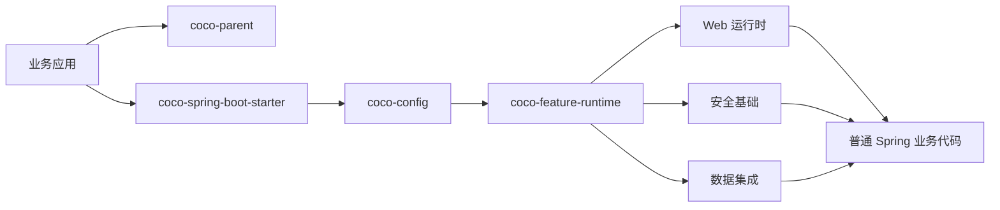

<div align="center">

# Coco Framework

<p>
  <strong>面向 Spring Boot Web 服务的高约定快速开发框架，用于构建可生产落地的 Java 服务。</strong>
</p>

<p>
  <a href="./README.md">English</a>
  ·
  <a href="./README_CN.md">简体中文</a>
</p>

<p>
  
  
  
  
</p>

<p>
  <a href="#引入方式">引入方式</a>
  ·
  <a href="#能力范围">能力范围</a>
  ·
  <a href="#边界">边界</a>
  ·
  <a href="#星星趋势">星星趋势</a>
  ·
  <a href="#贡献者">贡献者</a>
</p>

</div>

---

## 概览

Coco Framework 帮助团队快速搭建 Spring Boot Web 服务：框架提供高约定、可替换的黑盒基础设施，业务侧继续使用普通 Java/Spring 编程模型。

它适用于 SaaS 系统、内部服务、管理后台、集成服务和通用 Web API。它不是零代码业务运行时，也不会强制所有项目使用同一套用户、角色、菜单、组织或租户模型。

> 基础设施默认自动化；业务代码保持显式、可生成、由用户持有。

## 引入方式

业务应用使用 `coco-parent` 作为父 POM，并引入一个 starter。

```xml
<parent>
    <groupId>io.github.patton174</groupId>
    <artifactId>coco-parent</artifactId>
    <version>${coco.version}</version>
    <relativePath/>
</parent>

<dependencies>
    <dependency>
        <groupId>io.github.patton174</groupId>
        <artifactId>coco-spring-boot-starter</artifactId>
    </dependency>
</dependencies>
```

可选功能通过配置声明启停：

```yaml
coco:
  features:
    disabled:
      - mybatis-plus
      - tenant
      - data-permission
```

也可以通过 Java 配置声明：

```java
@CocoFeatures(disabled = {
        CocoFeature.TENANT,
        CocoFeature.DATA_PERMISSION
})
@Configuration(proxyBeanMethods = false)
class ApplicationCocoConfiguration {
}
```

业务 Controller 仍然是普通 Spring 代码：

```java
@RestController
@RequestMapping("/orders")
class OrderController {

    private final OrderService orderService;

    OrderController(OrderService orderService) {
        this.orderService = orderService;
    }

    @PostMapping
    OrderResponse create(@RequestBody CreateOrderRequest request) {
        return this.orderService.create(request);
    }
}
```

## 能力范围

<table>
  <tr>
    <td width="33%">
      <p></p>
      <strong>Web 运行时</strong><br/>
      统一响应、异常响应、链路标识、请求上下文、访问日志、请求签名、请求加密和防重放。
    </td>
    <td width="33%">
      <p></p>
      <strong>安全基础</strong><br/>
      安全主体、安全上下文持有器、解析器、认证断言、角色断言和权限断言。
    </td>
    <td width="33%">
      <p></p>
      <strong>数据集成</strong><br/>
      MyBatis-Plus 拦截器组装、分页、SQL 防护、租户 SQL 隔离和数据权限 SQL 条件。
    </td>
  </tr>
  <tr>
    <td width="33%">
      <p></p>
      <strong>功能控制</strong><br/>
      父 POM、BOM、单 starter、声明式功能选择、依赖感知的功能计划和运行时功能条件。
    </td>
    <td width="33%">
      <p></p>
      <strong>审计流水线</strong><br/>
      审计记录 SPI、发布器、失败策略和访问日志到审计事件的适配器。
    </td>
    <td width="33%">
      <p></p>
      <strong>代码生成边界</strong><br/>
      为显式源码脚手架预留生成器扩展点，避免隐藏式运行时 CRUD。
    </td>
  </tr>
</table>

## 边界

<table>
  <thead>
    <tr>
      <th width="50%">Coco 负责封装</th>
      <th width="50%">业务应用负责</th>
    </tr>
  </thead>
  <tbody>
    <tr>
      <td>starter 装配和自动配置组合</td>
      <td>领域模型和 API 语义</td>
    </tr>
    <tr>
      <td>功能启停、依赖传播和运行时功能门控</td>
      <td>Controller 形态和服务编排</td>
    </tr>
    <tr>
      <td>统一响应、类型化异常、国际化、链路上下文和访问日志</td>
      <td>事务边界和自定义持久化设计</td>
    </tr>
    <tr>
      <td>请求签名、请求加密、防重放、审计钩子、租户 SQL 和数据权限 SQL</td>
      <td>认证提供方、用户模型、组织模型、角色模型和生成后的 CRUD 代码</td>
    </tr>
  </tbody>
</table>

CRUD 应该走代码生成，而不是运行时暴露实体。生成后的代码应当是可读的 Java 源码，业务项目可以保留、修改、删除或替换。

## 运行形态



## 星星趋势

<!-- COCO_STATS_START -->
<table>
  <tr>
    <td align="center"><strong>1</strong><br/>星标</td>
    <td align="center"><strong>0</strong><br/>派生</td>
    <td align="center"><strong>1</strong><br/>贡献者</td>
    <td align="center"><a href="https://github.com/patton174/coco-framework">更新时间: 2026-07-09</a></td>
  </tr>
</table>
<!-- COCO_STATS_END -->

<a href="https://star-history.com/#patton174/coco-framework&Date">
  <picture>
    <source media="(prefers-color-scheme: dark)" srcset="https://api.star-history.com/svg?repos=patton174/coco-framework&type=Date&theme=dark"/>
    
  </picture>
</a>

## 贡献者

<!-- COCO_CONTRIBUTORS_START -->
<table>
  <tr>
    <td align="center">
      <a href="https://github.com/patton174">
        <br/>
        <sub>patton174</sub>
      </a>
    </td>
  </tr>
</table>
<p><a href="https://github.com/patton174/coco-framework/graphs/contributors">查看全部贡献者</a></p>
<!-- COCO_CONTRIBUTORS_END -->

<sub>星星和贡献者区域由 GitHub Actions 自动刷新。见 `.github/workflows/update-readme-insights.yml` 和 `tools/docs/update-readme-insights.mjs`。</sub>

## 许可证

Apache License 2.0.
