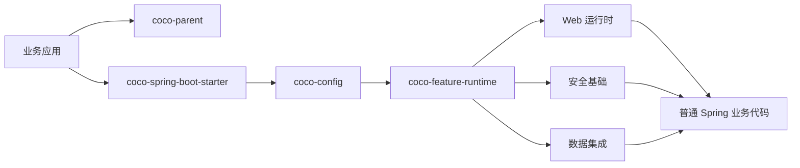

<!-- Generated from .github/readme/manifest.json. Edit the source fragments, then run: node .github/readme/scripts/render.mjs --write -->

<div align="center">

# Coco Framework

<p>
  <strong>面向 Spring Boot Web 服务的高约定快速开发框架，用于构建可生产落地的 Java 服务。</strong>
</p>

<p>
  <a href="./README.md">English</a>
  ·
  <a href="./README_CN.md">简体中文</a>
</p>

<p>
  
  
  
  
</p>

<p>
  <a href="#引入方式">引入方式</a>
  ·
  <a href="#能力范围">能力范围</a>
  ·
  <a href="#生产-sql-防护">SQL 防护</a>
  ·
  <a href="#边界">边界</a>
  ·
  <a href="#扩展边界">扩展边界</a>
  ·
  <a href="#示例">示例</a>
  ·
  <a href="#星标历史">星星趋势</a>
  ·
  <a href="#贡献者">贡献者</a>
</p>

</div>

---

## 概览

Coco Framework 帮助团队快速搭建 Spring Boot Web 服务：框架提供高约定、可替换的黑盒基础设施，业务侧继续使用普通 Java/Spring 编程模型。

它适用于 SaaS 系统、内部服务、管理后台、集成服务和通用 Web API。它不是零代码业务运行时，也不会强制所有项目使用同一套用户、角色、菜单、组织或租户模型。

> 基础设施默认自动化；业务代码保持显式、可生成、由用户持有。

## 引入方式

业务应用使用 `coco-parent` 作为父 POM，并引入一个 starter。

```xml
<parent>
    <groupId>io.github.patton174</groupId>
    <artifactId>coco-parent</artifactId>
    <version>${coco.version}</version>
    <relativePath/>
</parent>

<dependencies>
    <dependency>
        <groupId>io.github.patton174</groupId>
        <artifactId>coco-spring-boot-starter</artifactId>
    </dependency>
</dependencies>
```

可选功能通过配置声明启停：

```yaml
coco:
  features:
    disabled:
      - mybatis-plus
      - tenant
      - data-permission
```

也可以通过 Java 配置声明：

```java
@CocoFeatures(disabled = {
        CocoFeature.TENANT,
        CocoFeature.DATA_PERMISSION
})
@Configuration(proxyBeanMethods = false)
class ApplicationCocoConfiguration {
}
```

功能选择优先使用 YAML 或 `@CocoFeatures`。旧的 `CocoConfigurer` Java 钩子仅保留兼容，已不再推荐。

业务 Controller 仍然是普通 Spring 代码：

```java
@RestController
@RequestMapping("/orders")
class OrderController {

    private final OrderService orderService;

    OrderController(OrderService orderService) {
        this.orderService = orderService;
    }

    @PostMapping
    OrderResponse create(@RequestBody CreateOrderRequest request) {
        return this.orderService.create(request);
    }
}
```

## 显式 CRUD 源码生成

需要标准 CRUD 脚手架时，在业务项目根目录创建 `coco-codegen.yml`：

```yaml
base-package: com.example.catalog
resources:
  - name: Product
    table: catalog_product
    api-path: /products
    id: { name: id, column: id, type: Long, strategy: AUTO }
    fields:
      - { name: sku, column: sku, type: String, required: true }
      - { name: unitPrice, column: unit_price, type: BigDecimal, required: true }
```

然后显式运行：

```powershell
mvn coco:generate
```

生成器默认写入 `src/main/java`，并拒绝覆盖已有文件。它会生成普通的 Controller、DTO、应用服务、领域仓储契约和 MyBatis-Plus 基础设施源码；生成后由业务项目继续维护。该 goal 不绑定构建生命周期，也不会在运行时自动暴露实体。

## 生产 SQL 防护

Coco 默认不启用 MyBatis-Plus SQL 防护，避免首次接入时破坏已有维护 SQL。生产服务建议先回放或审查业务 SQL，再显式启用：

```yaml
coco:
  mybatis-plus:
    sql-guard:
      block-attack-enabled: true
      illegal-sql-enabled: true
```

启用后，MyBatis-Plus 可能拦截一些业务上合法但需要改写、复核或仅对受控维护语句显式忽略的 SQL：

- 没有有效 `WHERE` 的 `UPDATE` / `DELETE`，或包含 `1 = 1` 等恒真条件的批量写语句。
- 启用 `IllegalSQLInnerInterceptor` 后，没有 `WHERE` 的 `SELECT` / `UPDATE` / `DELETE`。
- `WHERE` 中使用 `OR`、`!=`、被检查列一侧使用函数，或被解析器识别为子查询形态。
- 谓词或 JOIN 条件中首个被检查字段没有命中索引元数据。
- JSQLParser 防护器无法稳定验证的复杂 JOIN、带 schema 的表名、数据库方言 SQL 或动态生成 SQL。

## 集群防重放

默认 `InMemoryCocoReplayStore` 明确是进程内实现，适合单实例和本地开发；集群服务必须使用共享存储。业务应用已经提供 Spring `JdbcOperations` 时，可以显式启用内置 JDBC 参考实现：

```yaml
coco:
  web:
    replay:
      store-type: jdbc
      jdbc:
        table-name: coco_replay_key
```

Coco 不自动执行数据库迁移。请通过业务项目已有的迁移流程创建等价结构，并按目标数据库方言调整以下基准 DDL：

```sql
CREATE TABLE coco_replay_key (
    replay_key_hash VARCHAR(64) NOT NULL,
    expires_at_epoch_millis BIGINT NOT NULL,
    PRIMARY KEY (replay_key_hash)
);
CREATE INDEX idx_coco_replay_key_expires_at
    ON coco_replay_key (expires_at_epoch_millis);
```

唯一键负责跨实例原子占用，Coco 只保存 SHA-256 摘要，并在后台清理过期记录。占用路径的数据库异常会让受保护请求失败关闭；异步清理失败只记录并重试。Servlet Filter 会在通常的 Controller 事务边界之前占用 key。表结构迁移、数据库可用性、集群时钟同步、直接调用时的事务使用和 exactly-once 副作用仍由业务应用负责。存在多个 `JdbcOperations` Bean 时，应给目标候选标记 `@Primary`，或提供自定义 `CocoReplayStore` 替换两种内置实现。

## 异步日志背压

Coco 日志默认使用有界异步队列。`ERROR` 和携带异常的记录始终同步写出；队列满时，`WARN` 也会回退为同步输出。被拒绝的 `TRACE`、`DEBUG` 和 `INFO` 仍允许丢弃，使队列提交不会等待可用容量。

每条实际丢弃都会增加进程内累计计数，每条非重入丢弃会通知 `CocoAsyncLogDropListener`。默认监听器直接通过 SLF4J 在首次丢弃以及累计数达到 2 的幂次时输出 WARN，既提供低噪声过载信号，也不会把诊断再次送入已满的 Coco 队列。业务可以用一个 Bean 替换：

```java
@Bean
CocoAsyncLogDropListener cocoAsyncLogDropListener(MeterRegistry registry) {
    Counter counter = registry.counter("coco.logging.async.dropped");
    return (level, handleName, totalDropped) -> counter.increment();
}
```

回调只接收级别、日志句柄名称和累计数，不暴露日志正文或异常。它在提交线程执行，业务实现必须快速并避免主动阻塞；并发回调会获得唯一累计值，但不保证跨线程顺序，监听器重入会被抑制且嵌套丢弃仍会计数。该机制只提供过载可观测性，不保证日志可靠交付；需要强交付保证的业务应替换 `CocoLogSink` 或审计记录器。

## 能力范围

<table>
  <tr>
    <td width="33%">
      <p></p>
      <strong>Web 运行时</strong><br/>
      统一响应、异常响应、链路标识、请求上下文、访问日志、请求签名、请求加密，以及进程内或共享 JDBC 防重放。
    </td>
    <td width="33%">
      <p></p>
      <strong>安全基础</strong><br/>
      安全上下文门面、解析 SPI、Web 上下文桥接、可信请求头适配、断言工具和上下文传播原语。
    </td>
    <td width="33%">
      <p></p>
      <strong>数据集成</strong><br/>
      MyBatis-Plus 拦截器组装、分页、SQL 防护、租户 SQL 隔离和数据权限 SQL 条件。
    </td>
  </tr>
  <tr>
    <td width="33%">
      <p></p>
      <strong>功能控制</strong><br/>
      父 POM、BOM、单 starter、声明式功能选择、依赖感知的功能计划和运行时功能条件。
    </td>
    <td width="33%">
      <p></p>
      <strong>审计流水线</strong><br/>
      默认结构化审计日志，以及格式化器和记录器 SPI、发布器、失败策略和访问日志适配器。
    </td>
    <td width="33%">
      <p></p>
      <strong>显式源码生成</strong><br/>
      可替换模板生成器、内置 CRUD 源码模板和安全写入；隐藏式运行时 CRUD Controller 明确不在范围内。
    </td>
  </tr>
</table>

## 边界

<table>
  <thead>
    <tr>
      <th width="50%">Coco 负责封装</th>
      <th width="50%">业务应用负责</th>
    </tr>
  </thead>
  <tbody>
    <tr>
      <td>starter 装配和自动配置组合</td>
      <td>领域模型和 API 语义</td>
    </tr>
    <tr>
      <td>功能启停、依赖传播和运行时功能门控</td>
      <td>Controller 形态和服务编排</td>
    </tr>
    <tr>
      <td>统一响应、类型化异常、国际化、链路上下文和访问日志</td>
      <td>事务边界和自定义持久化设计</td>
    </tr>
    <tr>
      <td>请求签名、请求加密、防重放、安全上下文生命周期桥接、审计钩子、租户 SQL 和数据权限 SQL</td>
      <td>认证提供方、用户模型、组织模型、角色模型和生成后的 CRUD 代码</td>
    </tr>
  </tbody>
</table>

CRUD 应该走代码生成，而不是运行时暴露实体。生成后的代码应当是可读的 Java 源码，业务项目可以保留、修改、删除或替换。

## 扩展边界

<table>
  <thead>
    <tr>
      <th width="25%">领域</th>
      <th width="38%">已交付边界</th>
      <th width="37%">业务应用或路线图负责</th>
    </tr>
  </thead>
  <tbody>
    <tr>
      <td>Replay</td>
      <td>进程内默认实现、显式共享 JDBC 参考实现、原子键占用、过期清理和可替换 Store SPI。</td>
      <td>数据库迁移与可用性、集群时钟同步、业务事务和 exactly-once 语义。</td>
    </tr>
    <tr>
      <td>Security</td>
      <td>上下文门面、解析 SPI、Servlet 上下文桥接、可信请求头适配、断言工具和上下文传播原语。</td>
      <td>认证提供方、RBAC/ABAC 模型、会话、令牌和用户存储。</td>
    </tr>
    <tr>
      <td>Audit</td>
      <td>事件契约、发布器、默认尽力而为的结构化日志、格式化器和记录器 SPI、失败策略和访问日志适配器。</td>
      <td>数据库落库、MQ 投递、合规报表和保留策略。</td>
    </tr>
    <tr>
      <td>OpenAPI</td>
      <td>元数据提供器、配置边界，以及业务项目已引入 SpringDoc 时的可选元数据适配器。</td>
      <td>文档渲染、UI 集成和接口级文档策略。</td>
    </tr>
    <tr>
      <td>Codegen</td>
      <td>生成器 SPI、内置 CRUD 模板、显式 Maven goal、覆盖保护和自定义模板位置。</td>
      <td>项目专属模板、业务规则，以及生成后的 CRUD 源码维护。</td>
    </tr>
  </tbody>
</table>

## 示例

<table>
  <thead>
    <tr>
      <th width="24%">示例</th>
      <th width="46%">验证范围</th>
      <th width="30%">入口</th>
    </tr>
  </thead>
  <tbody>
    <tr>
      <td><strong>Basic</strong></td>
      <td>无数据库场景下的统一响应、异常、i18n、Trace、签名、加密和防重放。</td>
      <td><a href="./coco-samples/coco-sample-basic/README.md">查看示例</a></td>
    </tr>
    <tr>
      <td><strong>Full</strong></td>
      <td>H2 + MyBatis-Plus，以及安全断言、租户 SQL 隔离、数据权限 SQL 过滤和审计发布。</td>
      <td><a href="./coco-samples/coco-sample-full/README.md">查看示例</a></td>
    </tr>
  </tbody>
</table>

## 运行形态



## Coco 生态

<table>
  <thead>
    <tr>
      <th width="24%">项目</th>
      <th width="46%">职责</th>
      <th width="30%">仓库</th>
    </tr>
  </thead>
  <tbody>
    <tr>
      <td><strong>Coco Framework</strong></td>
      <td>独立的 Spring Boot Web 服务器基础设施与稳定扩展边界。</td>
      <td><a href="https://github.com/patton174/coco-framework">coco-framework</a></td>
    </tr>
    <tr>
      <td><strong>Coco Admin</strong></td>
      <td>基于框架、使用普通业务代码实现的 ERP 产品与业务模块。</td>
      <td><a href="https://github.com/patton174/coco-admin">coco-admin</a></td>
    </tr>
    <tr>
      <td><strong>Coco Generate</strong></td>
      <td>开发期源码生成、可复用模板包和安全的生成文件管理。</td>
      <td><a href="https://github.com/patton174/coco-generate">coco-generate</a></td>
    </tr>
  </tbody>
</table>

依赖方向保持单向：Admin 运行时依赖 Framework，开发期可以使用 Generate；Generate 可以面向 Framework 契约产出代码；Framework 永远不依赖两个产品仓库。生成后的源码归业务应用所有，不会给业务运行时增加 Generate 依赖。

## 社区协作

<table>
  <tr>
    <td><a href="https://github.com/patton174/coco-framework/blob/main/CONTRIBUTING.md"><strong>参与贡献</strong></a><br/><sub>开发流程与评审要求</sub></td>
    <td><a href="https://github.com/patton174/coco-framework/discussions"><strong>讨论区</strong></a><br/><sub>问题交流、想法和接入指导</sub></td>
    <td><a href="https://github.com/patton174/coco-framework/security/policy"><strong>安全策略</strong></a><br/><sub>支持版本与私密漏洞报告</sub></td>
    <td><a href="https://github.com/patton174/coco-framework/blob/main/GOVERNANCE.md"><strong>仓库治理</strong></a><br/><sub>所有权、决策机制与受保护合并流程</sub></td>
  </tr>
</table>

## 星标历史

<!-- COCO_STATS_START -->
<table>
  <tr>
    <td align="center"><strong>1</strong><br/>星标</td>
    <td align="center"><strong>0</strong><br/>派生</td>
    <td align="center"><strong>1</strong><br/>贡献者</td>
    <td align="center"><a href="https://github.com/patton174/coco-framework">更新时间: 2026-07-20</a></td>
  </tr>
</table>
<!-- COCO_STATS_END -->

<a href="https://www.star-history.com/?repos=patton174%2Fcoco-framework&type=date&legend=bottom-right">
  <picture>
    <source media="(prefers-color-scheme: dark)" srcset="https://api.star-history.com/chart?repos=patton174/coco-framework&type=date&theme=dark&legend=bottom-right&sealed_token=WZtqAVEpmYHgLl3AUpfxFV4e_emJFt7fNK_ep9JrVVZ-tZvSoWbTwOEfvg8WIg0WEiosjWjZYSnF9DgC86cCiKp4iJ1uqirVm49z4-xECDHKRBogVqDokZF1cp6b00IInXU9FOcrhqR1nhcwP0t2KQhtRQAFe07t-K4PpUO7ERUjlhS6iRI1085j31pQ"/>
    <source media="(prefers-color-scheme: light)" srcset="https://api.star-history.com/chart?repos=patton174/coco-framework&type=date&legend=bottom-right&sealed_token=WZtqAVEpmYHgLl3AUpfxFV4e_emJFt7fNK_ep9JrVVZ-tZvSoWbTwOEfvg8WIg0WEiosjWjZYSnF9DgC86cCiKp4iJ1uqirVm49z4-xECDHKRBogVqDokZF1cp6b00IInXU9FOcrhqR1nhcwP0t2KQhtRQAFe07t-K4PpUO7ERUjlhS6iRI1085j31pQ"/>
    
  </picture>
</a>

## 贡献者

<!-- COCO_CONTRIBUTORS_START -->
<table>
  <tr>
    <td align="center">
      <a href="https://github.com/patton174">
        <br/>
        <sub>patton174</sub>
      </a>
    </td>
  </tr>
</table>
<p><a href="https://github.com/patton174/coco-framework/graphs/contributors">查看全部贡献者</a></p>
<!-- COCO_CONTRIBUTORS_END -->

<sub>星标和贡献者区域由 README 维护工作流自动刷新。见 `.github/workflows/readme-maintenance.yml` 和 `.github/readme/scripts/update-insights.mjs`。</sub>

## 许可证

Apache License 2.0.
