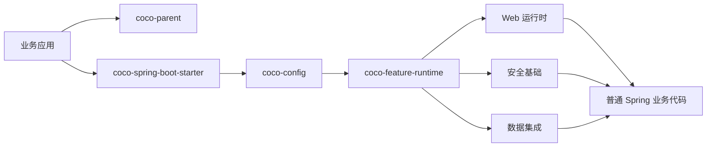

<!-- Generated from .github/readme/manifest.json. Edit the source fragments, then run: node .github/readme/scripts/render.mjs --write -->

<div align="center">


# Coco Framework

**少写基础设施，多写业务。**

Spring Boot · One starter · Plain Java

[English](README.md) · [简体中文](README_CN.md)

     

[**开始接入 →**](https://cocoframwork.dev/getting-started) · [文档](https://cocoframwork.dev/) · [GitHub Discussions](https://github.com/patton174/coco-framework/discussions)

</div>

---

## 为什么需要 Coco

每个项目都有自己的业务，但很多基础工作不必重新开始。

| 你可能正在做的事 | Coco 的处理方式 |
|---|---|
| 复制统一响应、异常处理和日志代码 | Starter 默认接入响应封装、全局异常与 TraceId |
| 手动梳理越来越多的配置 | YAML / 注解选择能力，构建与运行时使用一致的功能计划 |
| 从单机迁移到多实例 | 通过存储接口替换限流、幂等、锁等实现，显式配置 Redis 等服务 |
| 为框架重写业务模型 | 保留普通 Spring Controller，自行决定认证、组织与事务边界 |

| **17** 项主干功能标识 | **1** 个 Starter | **Java 17+** | **Apache-2.0** |
|---|---|---|---|
| 含 Codegen 兼容项 | 配合 parent / BOM | 业务编译目标 | 开源许可 |

> 当前稳定版为 **v2.0.2**。本 README 描述当前主干；缓存、通知、验证码等新增能力尚未全部进入稳定版。外部服务和多实例存储需要显式配置，不承诺所有功能零配置启动。

## 少维护一套装配

**手动组装：** 以下是需要维护的职责示意，并非可运行示例。

```java
@Configuration
class WebInfrastructure {
    // ResponseBodyAdvice：统一响应
    // RestControllerAdvice：异常处理
    // TraceId filter：请求关联
    // Access-log filter：访问日志
    // Context propagation：异步上下文
}
```

**接入 Coco：** 使用下方 parent 和一个 Starter，将这些集成点交给框架，业务仍是普通 Java / Spring。

## 如何选择

| 维度 | Spring Boot 自行组装 | Coco Framework |
|---|---|---|
| 默认行为 | 按项目组合响应、异常和日志约定 | 统一响应、异常与 TraceId 默认接入 |
| 能力覆盖 | 自行选择并集成生态库 | 以功能开关组合基础设施模块 |
| 扩展方式 | Spring Bean 与扩展接口 | 保留 Spring 扩展方式，增加领域明确的 SPI |
| 业务模型 | 自行设计 | 自行设计，不强制用户/角色/组织模型 |
| 工程治理 | 团队建立自己的流程 | 仓库提供 CI、Agent 评审与受保护合并流程 |

选型仍需结合你的依赖、业务边界与部署方式；此表描述集成方式，不是性能排名。

---

## 安装

用 `coco-parent` 作为应用父 POM，再加一个 starter 依赖。

```xml
<parent>
    <groupId>io.github.patton174</groupId>
    <artifactId>coco-parent</artifactId>
    <version>2.0.2</version>
    <relativePath/>
</parent>

<dependencies>
    <dependency>
        <groupId>io.github.patton174</groupId>
        <artifactId>coco-spring-boot-starter</artifactId>
    </dependency>
</dependencies>
```

接入到此结束。统一响应、全局异常处理、TraceId 链路默认开启；业务 Controller 保持普通 Spring 代码。

能力通过 YAML 或 `@CocoFeatures` 声明式启停：

```yaml
coco:
  features:
    disabled:
      - mybatis-plus
      - tenant
```

**→ [快速开始](https://cocoframwork.dev/getting-started)** 完整走一遍第一个服务。
**→ [特性开关](https://cocoframwork.dev/feature-toggles)** 列出全部开关及默认值。

## CRUD 源码生成

标准 CRUD 脚手架由独立工具 [coco-generate](https://github.com/patton174/coco-generate) 提供。它在开发期生成业务持有的普通源码——Controller、DTO、应用服务、领域仓储、MyBatis-Plus 基础设施——**不是**应用运行时依赖。默认写入 `src/main/java` 且拒绝覆盖已有文件，因此运行时不会自动暴露实体。

**→ [代码生成](https://cocoframwork.dev/features/codegen)** 讲解配置格式与模板。

## 生产注意事项

有几项默认值是刻意保守的——首次接入的安全选择，未必适合集群。它们在你显式启用前保持关闭或进程内：

| 关注点 | 默认 | 上生产时 |
|--------|------|---------|
| **SQL 防护** | 关闭，保证既有运维 SQL 不被打断 | 先复核你的 SQL，再启用 `block-attack` / `illegal-sql`——防护可能拒绝它无法可靠校验的合法语句 |
| **防重放** | `InMemoryCocoReplayStore`，仅进程内有效 | 换成 JDBC 存储（或自己的实现），让键预留在多实例间原子。框架不执行迁移，表结构由你负责 |
| **异步日志** | 有界队列；`ERROR` 与携带异常的记录始终同步写 | 替换 `CocoAsyncLogDropListener`，把丢弃计数接入你的监控。这是过载可观测性，不是投递保证 |

**→ [SQL 防护](https://cocoframwork.dev/features/mybatis-plus)** · **[防重放](https://cocoframwork.dev/features/request-security)** · **[日志与基础设施](https://cocoframwork.dev/features/infra)**

## 能力范围

<table>
  <tr>
    <td width="33%"><strong>🌐 Web 请求</strong><p>让每个接口遵循一致约定。</p><ul><li>统一响应与异常</li><li>TraceId 与访问日志</li><li>签名、加密与防重放</li></ul></td>
    <td width="33%"><strong>🗃 数据与权限</strong><p>将数据隔离放入查询链路。</p><ul><li>MyBatis-Plus 与分页</li><li>租户 SQL 隔离</li><li>数据权限条件</li></ul></td>
    <td width="33%"><strong>⏱ 流控与可靠性</strong><p>为频繁或重复的请求划清边界。</p><ul><li>限流与幂等</li><li>锁与调度</li><li>存储实现可替换</li></ul></td>
  </tr>
  <tr>
    <td width="33%"><strong>📦 文件与平台</strong><p>通用服务能力随应用成长。</p><ul><li>文件存储与缓存</li><li>消息与通知</li><li>验证码</li></ul></td>
    <td width="33%"><strong>🔎 审计与可观测性</strong><p>为重要操作留下线索。</p><ul><li>结构化审计事件</li><li>日志与上下文</li><li>OpenAPI 元数据</li></ul></td>
    <td width="33%"><strong>🧩 功能与扩展</strong><p>只带上需要的能力。</p><ul><li>声明式功能开关</li><li>构建期裁剪</li><li>Bean 与 SPI 替换</li></ul></td>
  </tr>
</table>

## 边界

框架负责**基础设施**；业务应用负责**领域模型、API 语义、认证提供者、用户/角色/组织模型**。

这条边界是刻意的：框架不猜测你的业务，只把重复的、跨项目一致的基础设施做成可替换的黑盒。每个 SPI 都可以用一个 `@Bean` 覆盖为你自己的实现。

CRUD 属于代码生成，不是运行时实体暴露——生成的是业务项目可保留、可修改、可删除的普通 Java 源码。

**→ [边界与设计哲学](https://cocoframwork.dev/overview)** —— 双方各自负责什么，以及什么明确不在范围内。

## Framework 验收

<table>
  <thead>
    <tr>
      <th width="24%">验收场景</th>
      <th width="46%">验证范围</th>
      <th width="30%">入口</th>
    </tr>
  </thead>
  <tbody>
    <tr>
      <td><strong>Basic</strong></td>
      <td>无数据库场景下的统一响应、异常、i18n、Trace、签名、加密和防重放。</td>
      <td><a href="https://github.com/patton174/coco-admin/tree/main/framework-acceptance">查看 coco-admin 验收</a></td>
    </tr>
    <tr>
      <td><strong>Full</strong></td>
      <td>H2 + MyBatis-Plus，以及安全断言、租户 SQL 隔离、数据权限 SQL 过滤和审计发布。</td>
      <td><a href="https://github.com/patton174/coco-admin/tree/main/framework-acceptance">查看 coco-admin 验收</a></td>
    </tr>
  </tbody>
</table>

> **Framework 验收：** 业务和 HTTP 验收由 `coco-admin/framework-acceptance` 维护。Coco Framework 不再维护业务 samples；新的源码生成由 `coco-generate` 承接。

## 运行形态


```mermaid
flowchart LR
    app["业务应用"] --> parent["coco-parent"]
    app --> starter["coco-spring-boot-starter"]
    starter --> config["coco-config"]
    config --> runtime["coco-feature-runtime"]
    runtime --> web["Web 运行时"]
    runtime --> security["安全基础"]
    runtime --> data["数据集成"]
    web --> business["普通 Spring 业务代码"]
    security --> business
    data --> business
```

## Coco 生态

<table>
  <thead>
    <tr>
      <th width="24%">项目</th>
      <th width="46%">职责</th>
      <th width="30%">仓库</th>
    </tr>
  </thead>
  <tbody>
    <tr>
      <td><strong>Coco Framework</strong></td>
      <td>独立的 Spring Boot Web 服务器基础设施与稳定扩展边界。</td>
      <td><a href="https://github.com/patton174/coco-framework">coco-framework</a></td>
    </tr>
    <tr>
      <td><strong>Coco Admin</strong></td>
      <td>基于框架、使用普通业务代码实现的 ERP 产品与业务模块。</td>
      <td><a href="https://github.com/patton174/coco-admin">coco-admin</a></td>
    </tr>
    <tr>
      <td><strong>Coco Generate</strong></td>
      <td>开发期源码生成、可复用模板包和安全的生成文件管理。</td>
      <td><a href="https://github.com/patton174/coco-generate">coco-generate</a></td>
    </tr>
  </tbody>
</table>

依赖方向保持单向：Admin 运行时依赖 Framework，开发期可以使用 Generate；Generate 可以面向 Framework 契约产出代码；Framework 永远不依赖两个产品仓库。生成后的源码归业务应用所有，不会给业务运行时增加 Generate 依赖。

## 社区协作

<table>
  <tr>
    <td><a href="https://github.com/patton174/coco-framework/blob/main/CONTRIBUTING.md"><strong>参与贡献</strong></a><br/><sub>开发流程与评审要求</sub></td>
    <td><a href="https://github.com/patton174/coco-framework/discussions"><strong>讨论区</strong></a><br/><sub>问题交流、想法和接入指导</sub></td>
    <td><a href="https://github.com/patton174/coco-framework/security/policy"><strong>安全策略</strong></a><br/><sub>支持版本与私密漏洞报告</sub></td>
    <td><a href="https://github.com/patton174/coco-framework/blob/main/GOVERNANCE.md"><strong>仓库治理</strong></a><br/><sub>所有权、决策机制与受保护合并流程</sub></td>
  </tr>
</table>

## 星标历史

<!-- COCO_STATS_START -->
<table>
  <tr>
    <td align="center"><strong>1</strong><br/>星标</td>
    <td align="center"><strong>1</strong><br/>派生</td>
    <td align="center"><strong>1</strong><br/>贡献者</td>
    <td align="center"><a href="https://github.com/patton174/coco-framework">更新时间: 2026-08-31</a></td>
  </tr>
</table>
<!-- COCO_STATS_END -->

<a href="https://www.star-history.com/?repos=patton174%2Fcoco-framework&type=date&legend=bottom-right">
  <picture>
    <source media="(prefers-color-scheme: dark)" srcset="https://api.star-history.com/chart?repos=patton174/coco-framework&type=date&theme=dark&legend=bottom-right&sealed_token=WZtqAVEpmYHgLl3AUpfxFV4e_emJFt7fNK_ep9JrVVZ-tZvSoWbTwOEfvg8WIg0WEiosjWjZYSnF9DgC86cCiKp4iJ1uqirVm49z4-xECDHKRBogVqDokZF1cp6b00IInXU9FOcrhqR1nhcwP0t2KQhtRQAFe07t-K4PpUO7ERUjlhS6iRI1085j31pQ"/>
    <source media="(prefers-color-scheme: light)" srcset="https://api.star-history.com/chart?repos=patton174/coco-framework&type=date&legend=bottom-right&sealed_token=WZtqAVEpmYHgLl3AUpfxFV4e_emJFt7fNK_ep9JrVVZ-tZvSoWbTwOEfvg8WIg0WEiosjWjZYSnF9DgC86cCiKp4iJ1uqirVm49z4-xECDHKRBogVqDokZF1cp6b00IInXU9FOcrhqR1nhcwP0t2KQhtRQAFe07t-K4PpUO7ERUjlhS6iRI1085j31pQ"/>
    
  </picture>
</a>

## 贡献者

<!-- COCO_CONTRIBUTORS_START -->
<table>
  <tr>
    <td align="center">
      <a href="https://github.com/patton174">
        <br/>
        <sub>patton174</sub>
      </a>
    </td>
  </tr>
</table>
<p><a href="https://github.com/patton174/coco-framework/graphs/contributors">查看全部贡献者</a></p>
<!-- COCO_CONTRIBUTORS_END -->

<sub>星标和贡献者区域由 README 维护工作流自动刷新。见 `.github/workflows/readme-maintenance.yml` 和 `.github/readme/scripts/update-insights.mjs`。</sub>

## 许可证

Apache License 2.0.
