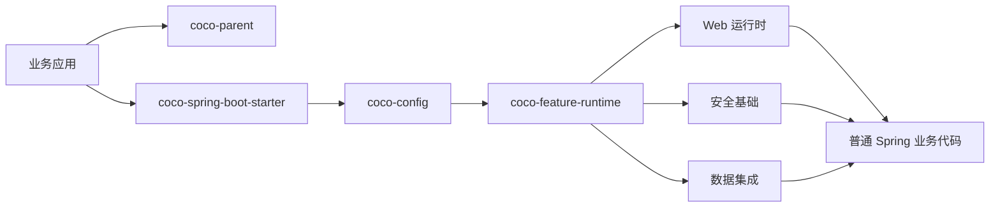

<!-- Generated from .github/readme/manifest.json. Edit the source fragments, then run: node .github/readme/scripts/render.mjs --write -->

<div align="center">

# Coco Framework

<p>
  <strong>面向 Spring Boot Web 服务的高约定快速开发框架，用于构建可生产落地的 Java 服务。</strong>
</p>

<p>
  <a href="./README.md">English</a>
  ·
  <a href="./README_CN.md">简体中文</a>
</p>

<p>
  
  
  
  
</p>

<p>
  <a href="https://patton174.github.io/coco-framework/"><strong>📖 文档</strong></a>
  ·
  <a href="https://patton174.github.io/coco-framework/getting-started">快速开始</a>
  ·
  <a href="https://patton174.github.io/coco-framework/features/web-runtime">能力参考</a>
  ·
  <a href="https://patton174.github.io/coco-framework/skills">Agent 技能</a>
</p>

<p>
  <a href="#安装">安装</a>
  ·
  <a href="#能力范围">能力范围</a>
  ·
  <a href="#边界">边界</a>
  ·
  <a href="#生产注意事项">生产注意事项</a>
  ·
  <a href="#贡献者">贡献者</a>
</p>

</div>

---

## 概览

Coco Framework 帮助团队快速搭建 Spring Boot Web 服务：框架提供高约定、可替换的黑盒基础设施，业务侧继续使用普通 Java/Spring 编程模型。

它适用于 SaaS 系统、内部服务、管理后台、集成服务和通用 Web API。它不是零代码业务运行时，也不会强制所有项目使用同一套用户、角色、菜单、组织或租户模型。

> 基础设施默认自动化；业务代码保持显式、可生成、由用户持有。

## 安装

用 `coco-parent` 作为应用父 POM，再加一个 starter 依赖。

```xml
<parent>
    <groupId>io.github.patton174</groupId>
    <artifactId>coco-parent</artifactId>
    <version>${coco.version}</version>
    <relativePath/>
</parent>

<dependencies>
    <dependency>
        <groupId>io.github.patton174</groupId>
        <artifactId>coco-spring-boot-starter</artifactId>
    </dependency>
</dependencies>
```

接入到此结束。统一响应、全局异常处理、TraceId 链路默认开启；业务 Controller 保持普通 Spring 代码。

能力通过 YAML 或 `@CocoFeatures` 声明式启停：

```yaml
coco:
  features:
    disabled:
      - mybatis-plus
      - tenant
```

**→ [快速开始](https://patton174.github.io/coco-framework/getting-started)** 完整走一遍第一个服务。
**→ [特性开关](https://patton174.github.io/coco-framework/feature-toggles)** 列出全部开关及默认值。

## CRUD 源码生成

标准 CRUD 脚手架由独立工具 [coco-generate](https://github.com/patton174/coco-generate) 提供。它在开发期生成业务持有的普通源码——Controller、DTO、应用服务、领域仓储、MyBatis-Plus 基础设施——**不是**应用运行时依赖。默认写入 `src/main/java` 且拒绝覆盖已有文件，因此运行时不会自动暴露实体。

**→ [代码生成](https://patton174.github.io/coco-framework/features/codegen)** 讲解配置格式与模板。

## 生产注意事项

有几项默认值是刻意保守的——首次接入的安全选择，未必适合集群。它们在你显式启用前保持关闭或进程内：

| 关注点 | 默认 | 上生产时 |
|--------|------|---------|
| **SQL 防护** | 关闭，保证既有运维 SQL 不被打断 | 先复核你的 SQL，再启用 `block-attack` / `illegal-sql`——防护可能拒绝它无法可靠校验的合法语句 |
| **防重放** | `InMemoryCocoReplayStore`，仅进程内有效 | 换成 JDBC 存储（或自己的实现），让键预留在多实例间原子。框架不执行迁移，表结构由你负责 |
| **异步日志** | 有界队列；`ERROR` 与携带异常的记录始终同步写 | 替换 `CocoAsyncLogDropListener`，把丢弃计数接入你的监控。这是过载可观测性，不是投递保证 |

**→ [SQL 防护](https://patton174.github.io/coco-framework/features/mybatis-plus)** · **[防重放](https://patton174.github.io/coco-framework/features/request-security)** · **[日志与基础设施](https://patton174.github.io/coco-framework/features/infra)**

## 能力范围

<table>
  <tr>
    <td width="33%">
      <p></p>
      <strong>Web 运行时</strong><br/>
      统一响应、异常响应、链路标识、请求上下文、访问日志、请求签名、请求加密和防重放。
    </td>
    <td width="33%">
      <p></p>
      <strong>安全基础</strong><br/>
      安全上下文门面、解析 SPI、Web 上下文桥接、可信请求头适配、断言工具和上下文传播原语。
    </td>
    <td width="33%">
      <p></p>
      <strong>数据集成</strong><br/>
      MyBatis-Plus 拦截器组装、分页、SQL 防护、租户 SQL 隔离和数据权限 SQL 条件。
    </td>
  </tr>
  <tr>
    <td width="33%">
      <p></p>
      <strong>流控与可靠性</strong><br/>
      限流、幂等、分布式锁、调度——每项都有进程内默认实现和可替换的存储 SPI。
    </td>
    <td width="33%">
      <p></p>
      <strong>平台能力</strong><br/>
      对象存储 SPI（含内容寻址的本地参考实现）、结构化审计流水线和 OpenAPI 元数据。
    </td>
    <td width="33%">
      <p></p>
      <strong>功能控制</strong><br/>
      父 POM、BOM、单 starter、声明式功能选择、依赖感知的功能计划和运行时功能条件。
    </td>
  </tr>
</table>

**→ [能力参考](https://patton174.github.io/coco-framework/features/web-runtime)** —— 逐个功能的配置项与 SPI。

## 边界

框架负责**基础设施**；业务应用负责**领域模型、API 语义、认证提供者、用户/角色/组织模型**。

这条边界是刻意的：框架不猜测你的业务，只把重复的、跨项目一致的基础设施做成可替换的黑盒。每个 SPI 都可以用一个 `@Bean` 覆盖为你自己的实现。

CRUD 属于代码生成，不是运行时实体暴露——生成的是业务项目可保留、可修改、可删除的普通 Java 源码。

**→ [边界与设计哲学](https://patton174.github.io/coco-framework/overview)** —— 双方各自负责什么，以及什么明确不在范围内。

## Framework 验收

<table>
  <thead>
    <tr>
      <th width="24%">验收场景</th>
      <th width="46%">验证范围</th>
      <th width="30%">入口</th>
    </tr>
  </thead>
  <tbody>
    <tr>
      <td><strong>Basic</strong></td>
      <td>无数据库场景下的统一响应、异常、i18n、Trace、签名、加密和防重放。</td>
      <td><a href="https://github.com/patton174/coco-admin/tree/main/framework-acceptance">查看 coco-admin 验收</a></td>
    </tr>
    <tr>
      <td><strong>Full</strong></td>
      <td>H2 + MyBatis-Plus，以及安全断言、租户 SQL 隔离、数据权限 SQL 过滤和审计发布。</td>
      <td><a href="https://github.com/patton174/coco-admin/tree/main/framework-acceptance">查看 coco-admin 验收</a></td>
    </tr>
  </tbody>
</table>

> **Framework 验收：** 业务和 HTTP 验收由 `coco-admin/framework-acceptance` 维护。Coco Framework 不再维护业务 samples；新的源码生成由 `coco-generate` 承接。

## 运行形态


```mermaid
flowchart LR
    app["业务应用"] --> parent["coco-parent"]
    app --> starter["coco-spring-boot-starter"]
    starter --> config["coco-config"]
    config --> runtime["coco-feature-runtime"]
    runtime --> web["Web 运行时"]
    runtime --> security["安全基础"]
    runtime --> data["数据集成"]
    web --> business["普通 Spring 业务代码"]
    security --> business
    data --> business
```

## Coco 生态

<table>
  <thead>
    <tr>
      <th width="24%">项目</th>
      <th width="46%">职责</th>
      <th width="30%">仓库</th>
    </tr>
  </thead>
  <tbody>
    <tr>
      <td><strong>Coco Framework</strong></td>
      <td>独立的 Spring Boot Web 服务器基础设施与稳定扩展边界。</td>
      <td><a href="https://github.com/patton174/coco-framework">coco-framework</a></td>
    </tr>
    <tr>
      <td><strong>Coco Admin</strong></td>
      <td>基于框架、使用普通业务代码实现的 ERP 产品与业务模块。</td>
      <td><a href="https://github.com/patton174/coco-admin">coco-admin</a></td>
    </tr>
    <tr>
      <td><strong>Coco Generate</strong></td>
      <td>开发期源码生成、可复用模板包和安全的生成文件管理。</td>
      <td><a href="https://github.com/patton174/coco-generate">coco-generate</a></td>
    </tr>
  </tbody>
</table>

依赖方向保持单向：Admin 运行时依赖 Framework，开发期可以使用 Generate；Generate 可以面向 Framework 契约产出代码；Framework 永远不依赖两个产品仓库。生成后的源码归业务应用所有，不会给业务运行时增加 Generate 依赖。

## 社区协作

<table>
  <tr>
    <td><a href="https://github.com/patton174/coco-framework/blob/main/CONTRIBUTING.md"><strong>参与贡献</strong></a><br/><sub>开发流程与评审要求</sub></td>
    <td><a href="https://github.com/patton174/coco-framework/discussions"><strong>讨论区</strong></a><br/><sub>问题交流、想法和接入指导</sub></td>
    <td><a href="https://github.com/patton174/coco-framework/security/policy"><strong>安全策略</strong></a><br/><sub>支持版本与私密漏洞报告</sub></td>
    <td><a href="https://github.com/patton174/coco-framework/blob/main/GOVERNANCE.md"><strong>仓库治理</strong></a><br/><sub>所有权、决策机制与受保护合并流程</sub></td>
  </tr>
</table>

## 星标历史

<!-- COCO_STATS_START -->
<table>
  <tr>
    <td align="center"><strong>1</strong><br/>星标</td>
    <td align="center"><strong>0</strong><br/>派生</td>
    <td align="center"><strong>1</strong><br/>贡献者</td>
    <td align="center"><a href="https://github.com/patton174/coco-framework">更新时间: 2026-07-20</a></td>
  </tr>
</table>
<!-- COCO_STATS_END -->

<a href="https://www.star-history.com/?repos=patton174%2Fcoco-framework&type=date&legend=bottom-right">
  <picture>
    <source media="(prefers-color-scheme: dark)" srcset="https://api.star-history.com/chart?repos=patton174/coco-framework&type=date&theme=dark&legend=bottom-right&sealed_token=WZtqAVEpmYHgLl3AUpfxFV4e_emJFt7fNK_ep9JrVVZ-tZvSoWbTwOEfvg8WIg0WEiosjWjZYSnF9DgC86cCiKp4iJ1uqirVm49z4-xECDHKRBogVqDokZF1cp6b00IInXU9FOcrhqR1nhcwP0t2KQhtRQAFe07t-K4PpUO7ERUjlhS6iRI1085j31pQ"/>
    <source media="(prefers-color-scheme: light)" srcset="https://api.star-history.com/chart?repos=patton174/coco-framework&type=date&legend=bottom-right&sealed_token=WZtqAVEpmYHgLl3AUpfxFV4e_emJFt7fNK_ep9JrVVZ-tZvSoWbTwOEfvg8WIg0WEiosjWjZYSnF9DgC86cCiKp4iJ1uqirVm49z4-xECDHKRBogVqDokZF1cp6b00IInXU9FOcrhqR1nhcwP0t2KQhtRQAFe07t-K4PpUO7ERUjlhS6iRI1085j31pQ"/>
    
  </picture>
</a>

## 贡献者

<!-- COCO_CONTRIBUTORS_START -->
<table>
  <tr>
    <td align="center">
      <a href="https://github.com/patton174">
        <br/>
        <sub>patton174</sub>
      </a>
    </td>
  </tr>
</table>
<p><a href="https://github.com/patton174/coco-framework/graphs/contributors">查看全部贡献者</a></p>
<!-- COCO_CONTRIBUTORS_END -->

<sub>星标和贡献者区域由 README 维护工作流自动刷新。见 `.github/workflows/readme-maintenance.yml` 和 `.github/readme/scripts/update-insights.mjs`。</sub>

## 许可证

Apache License 2.0.
