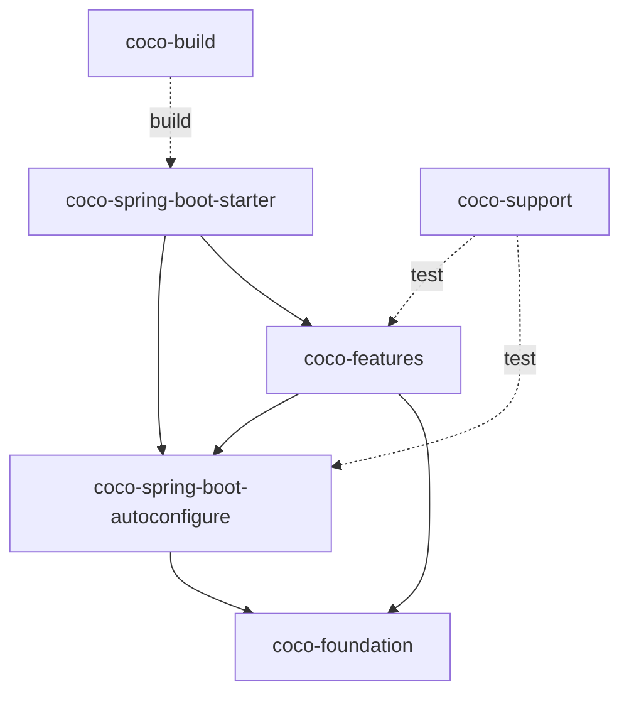

# Coco Framework 2.0 模块布局

## 定位

Coco Framework 2.0 按所有权和依赖方向组织模块。仓库外层目录统一保留 `coco-` 前缀；外层目录只表达职责边界，业务项目实际依赖的是其中发布到 Maven Central 的制品。

框架继续坚持单 starter、强约定和可替换基础设施，不把业务 CRUD、领域模型、查询和事务边界隐藏在运行时魔法中。

## 目标目录

```text
coco-build/
  coco-compatibility/
    coco-config/
    coco-feature-audit/
    coco-feature-data-permission/
    coco-feature-mybatis-plus/
    coco-feature-openapi/
    coco-feature-runtime/
    coco-feature-security/
    coco-feature-tenant/
    coco-feature-web/
    coco-test/
  coco-dependencies/
  coco-parent/
  coco-maven-plugin/
coco-foundation/
  coco-api/
  coco-context/
  coco-exception/
  coco-feature-model/
  coco-i18n/
  coco-logging/
coco-spring/
  coco-spring-boot-autoconfigure/
  coco-spring-boot-starter/
coco-features/
  coco-audit/
  coco-data-permission/
  coco-mybatis-plus/
  coco-openapi/
  coco-security/
  coco-tenant/
  coco-web/
  coco-feature-codegen/
coco-support/
  coco-document/
  coco-test-support/
  coco-tools/
coco-samples/
```

## 所有权

| 目录 | 职责 |
| --- | --- |
| `coco-build` | 依赖管理、推荐父 POM、构建期 feature 清单、打包裁剪和 2.x 旧坐标发布兼容 |
| `coco-foundation` | 稳定公共契约、通用上下文、异常、国际化、日志和与 Spring 无关的 feature 模型 |
| `coco-spring` | Spring Boot 自动配置、运行时 feature 计划和单 starter 组合入口 |
| `coco-features` | 可独立启停的 Web 服务器能力 |
| `coco-support` | 测试和开发辅助能力，不进入普通业务运行时 |

`coco-spring-boot-starter` 保留标准 Spring Boot starter 制品名，但只负责组合依赖，不承载具体 feature 行为。

`coco-build/coco-compatibility` 不是普通业务依赖入口。它只容纳已经公开发布、在 2.x 兼容窗口内必须继续可解析的旧 Maven 坐标；这些模块只能是 relocation POM 或无源码兼容门面，不得重新拥有实现、自动配置注册或资源。兼容模块可以在迁移批次中逐步归入该目录，目录中的旧坐标在下一主版本才可删除。

`coco-feature-codegen` 和 `coco-samples` 是 2.x 的受控过渡模块：前者在 `coco-generate` 完成带版本的跨仓迁移前继续支持现有 API 与 `coco:generate`，后者在 `coco-admin` 提供等价业务流 CI 前继续承担框架黑盒验证。它们不是新增业务运行时边界。

## 已发布兼容基线

`v2.0.1` 已经向 Maven Central 发布 `coco-config`、`coco-feature-runtime`、`coco-feature-*`、`coco-test`、`coco-feature-codegen` 和 `coco-maven-plugin`。因此早期“在公开 2.0 前直接删除旧坐标”的假设已经失效，后续 2.x 迁移必须遵守以下规则：

1. 新名称对应的制品成为框架内部和新业务项目的主路径；框架内部不得继续依赖仅为兼容保留的旧坐标。
2. 每个已发布旧坐标在 2.x 内必须继续可解析，并提供与其原有公开类型、配置和运行行为兼容的传递表面。优先使用无源码兼容 JAR；只有经过 Maven Resolver、插件和真实消费项目验证后才可改为 relocation POM。
3. 兼容制品不得复制实现类、自动配置导入、`spring.factories`、消息资源或模板。实现只能有一个物理所有者。
4. Java 包名、公开 FQCN、配置前缀、feature id、自动配置类名、消息 basename 和插件 goal 不因目录或 artifactId 重命名而改变；任何此类变更需要单独的主版本兼容评审。
5. BOM 必须同时管理 2.x 主坐标和仍受支持的旧坐标。starter 只组合主坐标，不通过旧兼容坐标间接获得能力。
6. 旧坐标的最终删除最早进入下一主版本，并且必须有发布说明、替代坐标和经过验证的消费迁移路径。

## 依赖方向



禁止 foundation 反向依赖 `coco-spring` 或具体 feature，也禁止把 feature 实现移动到 starter。构建模块可以读取 feature 元数据，但不能成为运行时业务依赖。

## 迁移规则

2.0 重构必须通过连续、可独立构建的 PR 完成，不使用管理员权限绕过普通代码评审：

1. Agent Review 同时识别 1.x 路径和 2.0 目标路径，并为重命名的旧、新两侧注入完整规格。
2. 先完成物理目录归组，不在同一 PR 中混入 Maven 坐标和 Java 包名变更。
3. 再按 foundation、Spring 组合层和各 feature 分批重命名、扁平化或合并主实现模块；已发布旧坐标同步转换为 2.x 兼容门面，而不是直接删除。
4. `coco-samples` 和 Codegen 实现只能在独立步骤移出框架仓库：`coco-admin` 必须先承接等价且持续通过的端到端验证，`coco-generate` 必须先承接公开 API、模板和生成行为。`coco:generate` 在 2.x 内继续由旧插件兼容，除非版本化迁移规格明确了新入口和双跑等价结果。
5. 每个 PR 的完整 diff 必须低于 Agent Review 的 `180000` 字符硬上限；必选策略和规格必须完整装入 `48000` 字符预算，不能截断或静默遗漏。
6. 每一步都必须通过 JDK 21 下的 Maven verify、release smoke、治理测试和当前 head 的三项合并门禁。

## 迁移映射

| 1.x 制品或目录 | 2.0 目标 |
| --- | --- |
| `coco-bom` | `coco-dependencies` |
| `coco-api-core` | `coco-api` |
| `coco-common-context` | `coco-context` |
| `coco-common-exception` | `coco-exception` |
| `coco-common-i18n` | `coco-i18n` |
| `coco-common-logging` | `coco-logging` |
| `coco-feature-registry` | `coco-feature-model` |
| `coco-config`, `coco-feature-runtime` | 实现合并到 `coco-spring-boot-autoconfigure`；旧坐标在 2.x 保留兼容入口 |
| 七个运行时 `coco-feature-*` | 实现迁移到对应 `coco-*` canonical 制品；旧坐标在 2.x 保留兼容入口 |
| `coco-test` | 实现迁移到 `coco-test-support`；旧坐标在 2.x 保留兼容入口 |
| `coco-feature-codegen`, `coco:generate` | 2.x 保持兼容，待 `coco-generate` 完成带版本的跨仓迁移 |
| `coco-samples` | 在 `coco-admin` 具备等价 CI 前继续保留为框架验证项目 |
