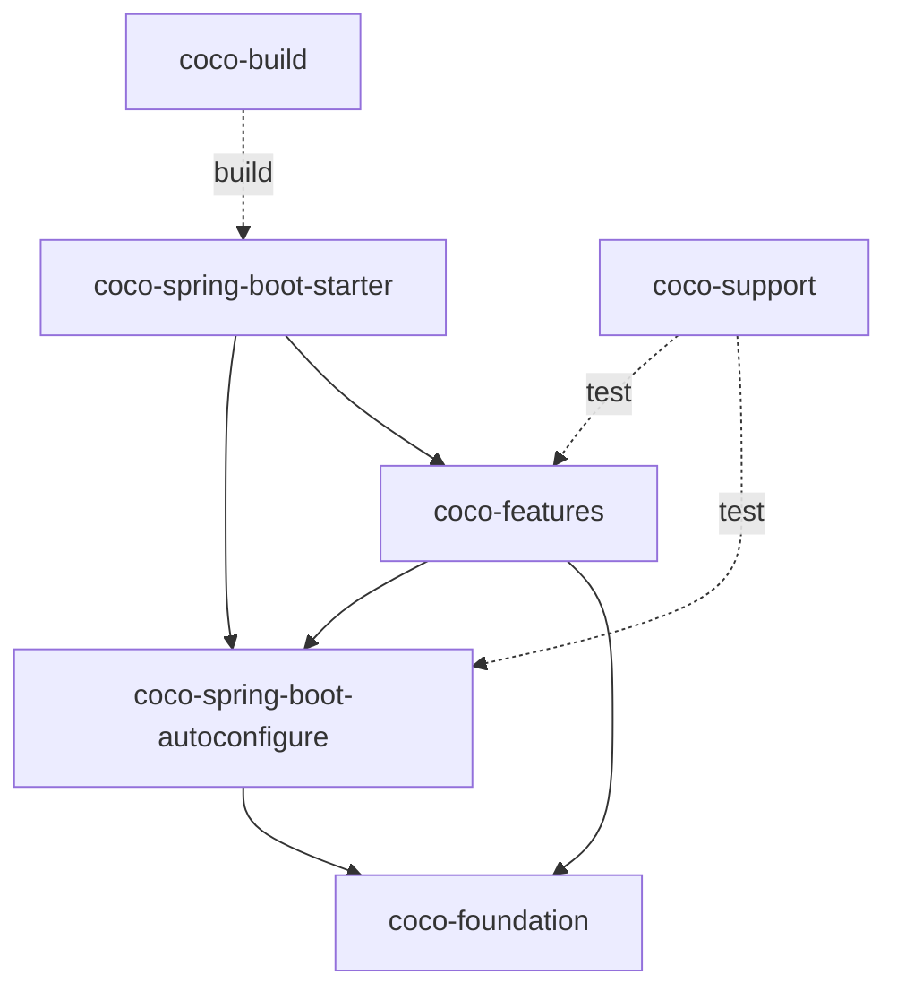

# Coco Framework 2.0 模块布局

## 定位

Coco Framework 2.0 按所有权和依赖方向组织模块。仓库外层目录统一保留 `coco-` 前缀；外层目录只表达职责边界，业务项目实际依赖的是其中发布到 Maven Central 的制品。

框架继续坚持单 starter、强约定和可替换基础设施，不把业务 CRUD、领域模型、查询和事务边界隐藏在运行时魔法中。

## 目标目录

```text
coco-build/
  coco-dependencies/
  coco-parent/
  coco-maven-plugin/
coco-foundation/
  coco-api/
  coco-context/
  coco-exception/
  coco-feature-model/
  coco-i18n/
  coco-logging/
coco-spring/
  coco-spring-boot-autoconfigure/
  coco-spring-boot-starter/
coco-features/
  coco-audit/
  coco-data-permission/
  coco-mybatis-plus/
  coco-openapi/
  coco-security/
  coco-tenant/
  coco-web/
coco-support/
  coco-document/
  coco-test-support/
  coco-tools/
```

## 所有权

| 目录 | 职责 |
| --- | --- |
| `coco-build` | 依赖管理、推荐父 POM、构建期 feature 清单和打包裁剪 |
| `coco-foundation` | 稳定公共契约、通用上下文、异常、国际化、日志和与 Spring 无关的 feature 模型 |
| `coco-spring` | Spring Boot 自动配置、运行时 feature 计划和单 starter 组合入口 |
| `coco-features` | 可独立启停的 Web 服务器能力 |
| `coco-support` | 测试和开发辅助能力，不进入普通业务运行时 |

`coco-spring-boot-starter` 保留标准 Spring Boot starter 制品名，但只负责组合依赖，不承载具体 feature 行为。

## 依赖方向



禁止 foundation 反向依赖 `coco-spring` 或具体 feature，也禁止把 feature 实现移动到 starter。构建模块可以读取 feature 元数据，但不能成为运行时业务依赖。

## 迁移规则

2.0 重构必须通过连续、可独立构建的 PR 完成，不使用管理员权限绕过普通代码评审：

1. Agent Review 同时识别 1.x 路径和 2.0 目标路径，并为重命名的旧、新两侧注入完整规格。
2. 先完成物理目录归组，不在同一 PR 中混入 Maven 坐标和 Java 包名变更。
3. 再按 foundation、Spring 组合层和各 feature 分批重命名、扁平化或合并模块。
4. `coco-samples` 和 `coco-feature-codegen` 在独立步骤移出框架仓库，分别由 `coco-admin` 和 `coco-generate` 承接。
5. 每个 PR 的完整 diff 必须低于 Agent Review 的 `180000` 字符硬上限；必选策略和规格必须完整装入 `48000` 字符预算，不能截断或静默遗漏。
6. 每一步都必须通过 JDK 21 下的 Maven verify、release smoke、治理测试和当前 head 的三项合并门禁。

## 迁移映射

| 1.x 制品或目录 | 2.0 目标 |
| --- | --- |
| `coco-bom` | `coco-dependencies` |
| `coco-api-core` | `coco-api` |
| `coco-common-context` | `coco-context` |
| `coco-common-exception` | `coco-exception` |
| `coco-common-i18n` | `coco-i18n` |
| `coco-common-logging` | `coco-logging` |
| `coco-feature-registry` | `coco-feature-model` |
| `coco-config`, `coco-feature-runtime` | 合并到 `coco-spring-boot-autoconfigure` |
| `coco-feature-*` | 对应的 `coco-*` feature 制品 |
| `coco-test` | `coco-test-support` |
| `coco-feature-codegen`, `coco:generate` | 移至 `coco-generate` |
| `coco-samples` | 移出框架；产品接入参考 `coco-admin` |
