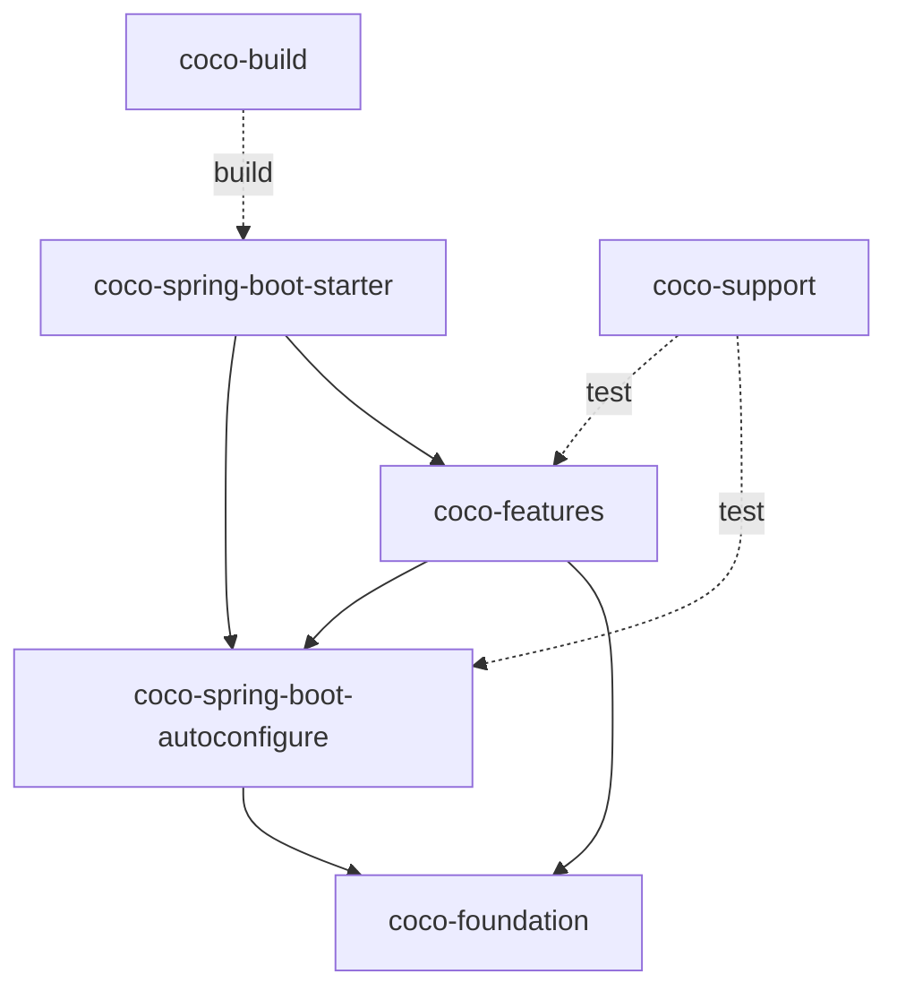

# Coco Framework 2.0 模块布局

## 定位

Coco Framework 2.0 按所有权和依赖方向组织模块。仓库外层目录统一保留 `coco-` 前缀；外层目录只表达职责边界，业务项目实际依赖的是其中发布到 Maven Central 的制品。

框架继续坚持单 starter、强约定和可替换基础设施，不把业务 CRUD、领域模型、查询和事务边界隐藏在运行时魔法中。

## 目标目录

```text
coco-build/
  coco-dependencies/
  coco-parent/
  coco-maven-plugin/
  coco-compatibility/
    ... 2.x legacy-coordinate facades only ...
coco-foundation/
  coco-api/
  coco-context/
  coco-exception/
  coco-feature-model/
  coco-i18n/
  coco-logging/
coco-spring/
  coco-spring-boot-autoconfigure/
  coco-spring-boot-starter/
coco-features/
  coco-audit/
  coco-feature-codegen/  ... 2.x legacy compatibility surface ...
  coco-data-permission/
  coco-mybatis-plus/
  coco-openapi/
  coco-idempotency/
  coco-messaging/
  coco-scheduling/
  coco-lock/
  coco-storage/
  coco-security/
  coco-tenant/
  coco-web/
coco-support/
  coco-document/
  coco-test/
  coco-feature-archive-smoke/  ... reactor-only Boot archive fixture ...
  coco-test-support/
  coco-tools/
```

`coco-idempotency` 是显式启用的 Servlet 写请求幂等功能。它不缓存或回放首次响应；仅正常完成的 `2xx/3xx` 保留租约到 TTL，异常及所有 `4xx/5xx` 均释放租约以允许安全重试。

`coco-messaging` 是默认由单一 starter 组合的进程内消息能力。业务项目可通过声明 `CocoMessageTransport` Bean 替换传输实现，不依赖 Web 或 MyBatis 能力。

`coco-scheduling` 是默认由单一 starter 组合的本地任务调度能力，支持注解和动态注册任务，不依赖 Web 或 MyBatis 能力。

`coco-lock` 是默认由单一 starter 组合的方法级分布式锁能力，可替换原子存储实现，不依赖 Web 或 MyBatis 能力。

`coco-storage` 是默认由单一 starter 组合的对象存储 SPI，提供安全本地参考实现，业务项目可替换实现，不依赖 Web 或 MyBatis 能力。

## 所有权

| 目录 | 职责 |
| --- | --- |
| `coco-build` | 依赖管理、推荐父 POM、构建期 feature 清单、打包裁剪和 2.x 旧坐标发布兼容 |
| `coco-foundation` | 稳定公共契约、通用上下文、异常、国际化、日志和与 Spring 无关的 feature 模型 |
| `coco-spring` | Spring Boot 自动配置、运行时 feature 计划和单 starter 组合入口 |
| `coco-features` | 可独立启停的 Web 服务器能力，以及已发布 Codegen 的 2.x 兼容实现 |
| `coco-support` | 测试和开发辅助能力，不进入普通业务运行时；其中 `coco-feature-archive-smoke` 对当前反应堆的 Boot archive、manifest 和索引执行裁剪验证 |

`coco-spring-boot-starter` 保留标准 Spring Boot starter 制品名，但只负责组合依赖，不承载具体 feature 行为。

`coco-build/coco-compatibility` 不是普通业务依赖入口。它只容纳已经公开发布、在 2.x 兼容窗口内必须继续可解析的旧 Maven 坐标；这些模块只能是 relocation POM 或无源码兼容门面，不得重新拥有实现、自动配置注册或资源。兼容模块可以在迁移批次中逐步归入该目录，目录中的旧坐标在下一主版本才可删除。

## 已发布兼容基线

`v2.0.1` 已经向 Maven Central 发布 `coco-config`、`coco-feature-runtime`、`coco-feature-*`、`coco-test`、`coco-feature-codegen` 和 `coco-maven-plugin`。因此早期“在公开 2.0 前直接删除旧坐标”的假设已经失效，后续 2.x 迁移必须遵守以下规则：

1. 新名称对应的制品成为框架内部和新业务项目的主路径；框架内部不得继续依赖仅为兼容保留的旧坐标。
2. 每个已发布旧坐标在 2.x 内必须继续可解析，并提供与其原有公开类型、配置和运行行为兼容的传递表面。优先使用无源码兼容 JAR；只有经过 Maven Resolver、插件和真实消费项目验证后才可改为 relocation POM。
3. 兼容制品不得复制实现类、自动配置导入、`spring.factories`、消息资源或模板。实现只能有一个物理所有者。
4. Java 包名、公开 FQCN、配置前缀、feature id 和插件 goal 不因目录或 artifactId 重命名而改变；任何此类变更需要单独的主版本兼容评审。
5. BOM 必须同时管理 2.x 主坐标和仍受支持的旧坐标。starter 只组合主坐标，不通过旧兼容坐标间接获得能力。
6. 旧坐标的最终删除最早进入下一主版本，并且必须有发布说明、替代坐标和经过验证的消费迁移路径。

## 依赖方向


```mermaid
flowchart TD
    starter["coco-spring-boot-starter"] --> autoconfigure["coco-spring-boot-autoconfigure"]
    starter --> features["coco-features"]
    features --> autoconfigure
    features --> foundation["coco-foundation"]
    autoconfigure --> foundation
    support["coco-support"] -. "test" .-> features
    support -. "test" .-> autoconfigure
    build["coco-build"] -. "build" .-> starter
```

禁止 foundation 反向依赖 `coco-spring` 或具体 feature，也禁止把 feature 实现移动到 starter。构建模块可以读取 feature 元数据，但不能成为运行时业务依赖。

## 迁移规则

2.0 重构必须通过连续、可独立构建的 PR 完成，不使用管理员权限绕过普通代码评审：

1. Agent Review 同时识别 1.x 路径和 2.0 目标路径，并为重命名的旧、新两侧注入完整规格。
2. 先完成物理目录归组，不在同一 PR 中混入 Maven 坐标和 Java 包名变更。
3. 再按 foundation、Spring 组合层和各 feature 分批重命名、扁平化或合并主实现模块；已发布旧坐标同步转换为 2.x 兼容门面，而不是直接删除。
4. Framework 不再维护业务 samples。等价 HTTP + H2/MyBatis-Plus 验收由 `coco-admin/framework-acceptance` 承接；新生成能力由 `coco-generate` 承接。框架保留 `coco-feature-codegen` 和 `coco:generate` 作为 2.x legacy compatibility surface，只维护兼容和安全修复；框架不得依赖 `coco-generate`。
5. 每个 PR 的完整 diff 必须低于 Agent Review 的 `180000` 字符硬上限；必选策略和规格必须完整装入 `52000` 字符预算，不能截断或静默遗漏。
6. 每一步都必须通过 JDK 21 下的 Maven verify、release smoke、治理测试和当前 head 的三项合并门禁。

## 迁移映射

| 1.x 制品或目录 | 2.0 目标 |
| --- | --- |
| `coco-bom` | `coco-dependencies` |
| `coco-api-core` | `coco-api` |
| `coco-common-context` | `coco-context` |
| `coco-common-exception` | `coco-exception` |
| `coco-common-i18n` | `coco-i18n` |
| `coco-common-logging` | `coco-logging` |
| `coco-feature-registry` | `coco-feature-model` |
| `coco-config`, `coco-feature-runtime` | 实现合并到 `coco-spring-boot-autoconfigure`；旧坐标作为 2.x 无源码兼容门面保留 |
| `coco-feature-*` | 对应的 `coco-*` 主 feature 制品；旧坐标作为 2.x 兼容门面保留 |
| `coco-test` | `coco-test-support` 主制品；`coco-test` 作为 2.x 兼容门面保留 |
| `coco-feature-codegen`, `coco:generate` | 2.x legacy compatibility surface；现有 API、`CocoFeature.CODEGEN` 和 goal 继续可用，新生成能力与模板扩展由 `coco-generate` 承接 |
