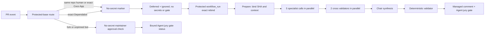

# Coco 多 Agent 代码评审团规格

<!-- coco-agent-deferred-binding-contract:v1 {"canonical":["ID","name","path","state"],"source":["workflow_id","path","event","repository"],"association":["structured pull_requests","current PR re-fetch"],"jobs":{"route":"success","marker":"success","others":"skipped"},"untrusted":["run-name","name","display_title"]} -->

## 问题

当前 Agent Review 只有一次模型调用。Workflow 把 PR diff 交给一个模型
实例，读取一条 `VERDICT: PASS|BLOCK`，再通过固定 marker 更新一条评论。

这套实现可以校验输出格式，但存在三个结构性问题：

- 单个模型同时负责发现、验证和裁决，提示词偏差或幻觉会直接变成门禁结论。
- 评论只有最终 Markdown，看不出哪些专业角色实际执行、哪些意见被质疑或验证。
- 上下文主要是 diff 和一段通用提示词，缺少 PR 意图、受保护项目规范、相关规格、
  模块依赖、完整变更文件和测试上下文之间的明确优先级。

评审团不是把多个关注点写进同一个大 prompt。每位评审必须是隔离的模型调用，
第一轮互不读取其他成员结论；交叉验证和最终综合必须是后续独立阶段。

## 调研依据

本规格吸收以下开源实现中已经验证的机制，但不直接引入其运行时：

- [The-PR-Agent/pr-agent](https://github.com/The-PR-Agent/pr-agent)：动态、非对称 diff
  上下文，严格结构化输出，以及“低严重度问题没有具体触发场景就不报告”的约束。
- [open-code-review](https://github.com/spencermarx/open-code-review)：项目上下文按优先级
  发现，多角色独立评审，`AGREE / CHALLENGE / CONNECT / SURFACE` 讨论阶段和完整归因。
- [gossipcat-ai](https://github.com/gossipcat-ai/gossipcat-ai)：finding ID、代码 anchor、
  `AGREE / DISAGREE / UNVERIFIED` 三态验证，以及把缺少证据与事实错误分开处理。
- [adversarial-review](https://github.com/alecnielsen/adversarial-review)：独立评审、交叉审查、
  meta review 和最终综合的分阶段对抗流程。
- [claude-code-review-council](https://github.com/yeameen/claude-code-review-council)：
  单轴专职评审、盲审 robustness 角色、来源标记和人工核对引用位置。

不直接安装这些项目，原因是 Coco 已有受保护的 HTTP 模型供应商边界；外部 CLI、MCP
服务、多供应商密钥、持久化数据库或自动改代码能力都会扩大供应链和权限面。Coco
只实现 PR 门禁需要的最小评审团内核。

## 目标

- 5 个专职评审并行、独立地产生结构化 findings。
- 2 个交叉验证者分别验证事实证据和项目政策，降低单点幻觉和政策误判。
- 1 个主席负责去重、归因和排版，不拥有独立降低或升级门禁的权限。
- 机器协议使用 JSON；Markdown 仅用于最终人类可读评论。
- 评审输入绑定固定的 base SHA、head SHA、protocol SHA-256 和 context SHA-256。
- 同仓库且 GitHub API 返回 `User` 类型、非空 login、正整数 user ID 的普通用户，以及受保护变量
  精确固定 login、`Bot` 类型、正整数 Bot ID 的 Coco Agent App，必须先经过受保护 base 的
  no-secret marker，再由默认分支 `workflow_run` 延迟进入 secret-backed 评审团。
- 受保护 base config 精确固定的 `dependabot[bot]` / `Bot` / `49699333` 也使用同一 marker 和
  `workflow_run` 路径；所有源 PR 事件不运行模型、不读取 secrets、不发布最终 jury gate。
- fork、未固定身份或身份不匹配的 bot PR 不接触模型供应商配置或凭据，只能由维护者对当前
  head SHA 明确批准。
- secret-backed 路径使用一条受管汇总评论展示全部角色、执行状态、共识、争议和上下文
  来源。
- `Agent jury gate` 是唯一稳定的 Agent 门禁名称；角色 job 名称不进入分支保护。

## 非目标

- 让 Agent 自动修改 PR 代码。
- 让 `GITHUB_TOKEN` 自动提交 GitHub `APPROVE` review。
- 把静态分析、测试或 CodeQL 结果替换成模型判断。
- 在 v1 引入跨 PR 的 Agent 信誉数据库或在线学习。
- 为超大 PR 静默截断 diff 后给出通过结论。
- 把审计报告中的历史结论全部当成永久规范注入。

## 信任边界

源路由 workflow 使用 `pull_request_target` / `pull_request_review`，并始终从受保护 base SHA
读取路由器、marker 和共享评审实现：

- workflow YAML；
- 评审脚本和 JSON schema；
- 角色提示词；
- `AGENTS.md`、评审政策和相关规格；
- 上下文构建规则。

PR 标题、正文、commit message、文件名、diff、head 文件内容和所有模型输出都是不可信
数据。它们只能进入 user/context 数据区，不能拼入 system 指令区。

任何阶段都不 checkout、编译、执行或 source PR head 内容。head 文件通过 GitHub API
按固定 SHA 读取，仅作为文本进入上下文。

publisher 的专用 App 安装令牌只申请 `Issues: write` 与
`Pull requests: write`，分别用于 finding Issue 和 PR 汇总评论；commit status 由内置
GitHub Actions App 发布。

### 模型供应商配置契约

受保护 repository variables 为 `COCO_AGENT_MODEL_PROTOCOL`（仅 `anthropic-messages` /
`openai-chat-completions` / `openai-responses`）、`COCO_AGENT_MODEL_BASE_URL`（仅 HTTPS origin 或末段精确 `/v1` 的 base
path；拒绝完整 `/responses`/`/messages` endpoint、凭据、query、fragment）、
`COCO_AGENT_MODEL` 和 `COCO_AGENT_MODEL_THINKING`（仅 `auto` / `enabled` /
`disabled`）。`auto` 不发送供应商特定的思考开关；`enabled` / `disabled` 在
OpenAI Chat Completions 请求中映射为 `chat_template_kwargs.enable_thinking`。
API key 仅存为 `coco-agent-model` environment secret
`COCO_AGENT_MODEL_API_KEY`；该 environment 仅限 `main`、禁管理员 bypass，只供三个模型 job。
`pull_request_target` 不得调用声明该 environment 的 reusable job；只有在受保护默认分支
`workflow_run` 中显式传入 `allow_deferred=true` 时，模型 job 和 `coco-agent` publisher 才能运行。

prepare 绑定四变量摘要；admission 必须用当前四变量严格复核 metadata digest。两者及
fork/no-secret 不得读 key；reusable 不声明 secrets，caller 不得继承。配置缺失、未知协议或
envelope 不匹配均 fail closed。README 旧配置仅保留至单独迁移，Agent Review 不得使用。

`pull_request_target` 调用 reusable 时，environment deployment ref 绑定 PR head，因此源 run
不得读取模型 key 或 App 私钥。符合资格的源 run 仅输出 `deferred + ignored`，且只能有唯一成功的
`Route bound pull request` 与 `Emit protected no-secret marker` jobs；不构建上下文、不查询批准、
不发布 jury status，其他 jobs 只能 skipped。只有受保护默认分支 `workflow_run` 可获得 secrets；
它先通过 GitHub API 解析受保护 `.github/workflows/agent-review.yml` 的 canonical workflow
ID/name/path，再要求 source run 的 `workflow_id` 精确相同、canonical name/path 和 source
path/event 均符合预期；随后绑定 run/head repository ID/full name、结构化关联中的唯一
PR/base/head、head branch、当前 PR/base/head 和精确作者 login/type/ID。evaluated `run-name`、
`name` 和 `display_title` 不是 workflow identity 或 PR/base/head 绑定输入。publisher 写入前再次
执行同一绑定。延迟入口不 checkout PR head/merge ref，不读取 source-run artifact/cache；无完整
marker 或身份不符时输出 `eligible=false` 并跳过 secret-backed job。
该临时结果不上传为 artifact，外部 fork 则在 workflow 条件中按 repository ID/full name 直接跳过。

## 工作流拓扑



### Prepare

1. 从 GitHub API 读取 PR，并固定 `base_sha`、`head_sha`。
2. 校验 PR 仍然 open、目标为 `main`。
3. 校验 `changed_files` 不超过 GitHub 的 3,000 文件平台上限，并要求 Files API 分页结果与其
   精确一致。300 文件以内读取 raw diff；超过 300 文件时使用 Files API patch 重建完整 diff，
   逐文件校验状态、重命名或复制来源路径、hunk 声明的旧新行数以及实际增删行；hunk 外的
   文件头只作为 metadata，不计入增删统计。任一 patch 缺失、为空或被截断时聚合列出全部
   异常文件并失败，不生成部分评审上下文。
4. 对 README automation dispatch 额外校验仓库、分支、作者、文件集合和 payload SHA。
5. 构建上下文后再次读取 PR；SHA 变化立即终止，让新事件创建新一轮。
6. 对 base 版本的配置、提示词和评审脚本计算 protocol SHA-256，再对包含该协议描述的
   canonical context JSON 计算 context SHA-256。
7. 上传只读 context artifact，并把 `Agent jury gate` 标为 pending。

### Specialist

固定角色如下：

| Role | 关注范围 |
| --- | --- |
| `architecture-api` | 框架定位、模块依赖、starter/autoconfiguration、公共 API/SPI、兼容性 |
| `correctness` | 逻辑、并发、资源、异常传播、功能计划、构建期/运行期一致性 |
| `security-isolation` | workflow/secrets、请求安全、租户、数据权限、SQL、加密和重放 |
| `tests-release` | 测试充分性、跨平台、Maven 插件、打包裁剪、发布和运维回归 |
| `robustness-blind` | 不读取 PR 意图；专查输入漂移、静默丢弃、规模假设、可观测性和未约束不变量 |

所有 specialist 读取同一 `head_sha` 和 `context_sha256`。第一轮互相不可见。

### Cross Review

- `evidence-verifier`：仅逐条核对 P0/P1 blocker candidate 的文件、行号、代码 anchor、触发场景和
  实际行为，输出 `AGREE / DISAGREE / UNVERIFIED`。
- `policy-skeptic`：仅逐条核对 P0/P1 blocker candidate 是否违反受保护项目规范、是否把非目标或明确治理
  选择误判为缺陷、严重度是否成立，同样输出三态结果。

`DISAGREE` 必须提供代码或规范反证。缺少上下文不能写 `DISAGREE`，只能写
`UNVERIFIED`。

两个 verifier 均存在；P0/P1 由二者独立验证，双 `AGREE` 才 blocker。无 P0/P1
时协调器不得调用模型，而是生成绑定 schema、role、head SHA、context SHA-256 的 `NOT_NEEDED` 报告。

P2/P3 不进 verifier 或作 jury blocker，由 specialist、chair、评论保留。chair 按 source ID
发布 finding Issue；仅影响 `Agent issue gate`。

下游只能读取结构化 severity、finding ID 和显式 verifier status。不得从 finding 或 verifier
文本、关键词、正则、`confidence` 或其他文本启发式推导共识、严重度或 actionable 资格。

### Chair

主席只能：

- 合并重复 finding；
- 保留来源和不同意见；
- 把确定性验证器已确认的 blocker 排版到最终报告；
- 从保留的 P2/P3 source finding 中选择非阻断 follow-up；
- 把被反驳或无法验证的意见放入折叠区；
- 汇总非阻断建议和待澄清问题。

主席不能创建无 source ID blocker，或把未双验证 P0/P1 升级为 blocker。P2/P3 必须展示且只能作为
非阻断 follow-up 进入 `actionable_groups`；选中 group 可创建只影响 `Agent issue gate` 的受管 Issue。
`actionable_groups` 是完整且严格的结构化契约：每个 group 必须含一个合法 primary source
finding ID 和有序、唯一、且不含 primary 的 duplicate ID 列表。缺失、非对象、非法 primary、
重复成员或错误类型均为基础设施失败，协调器不得静默忽略任何条目。

## 上下文模型

### 优先级

上下文按以下优先级构建并保留来源：

1. **受保护政策**：`AGENTS.md` 和 `.github/agent-review/policy.md`。
2. **相关规格**：由新旧变更路径映射到 `coco-support/coco-document/superpowers/specs/*.md`，只读取 base 版本；
   所有命中的规格必须完整注入，否则上下文构建失败。
3. **PR 意图**：标题、正文、commit message；标记为不可信声明，不覆盖政策和代码事实。
4. **变更清单**：文件状态、增删行、模块归属和 diff hash。
5. **代码证据**：patch、head 完整文件或动态 hunk、base 对照、相关测试和模块 POM。
6. **省略清单**：因大小或二进制原因没有注入的文件，要求 reviewer 使用
   `UNVERIFIED`，不得猜测。

### 动态代码上下文

- 小文件在预算内提供完整 head 内容；删除文件提供完整 base 内容。
- 大文件围绕每个 hunk 提供更多前置上下文和较少后置上下文。
- Java hunk 最多向前搜索 30 行，优先扩展到最近的方法、构造器、类或注解边界。
- 自动补充同模块 `pom.xml`、对应测试文件、AutoConfiguration imports 和配置 metadata。
- 变更文本文件先在仓库区域之间确定性轮询，再在区域内优先删除、构建治理文件、主代码、
  测试和文档；最多为 24 个变更文本文件读取补充代码上下文。
- 二进制或不支持的文件不读取完整内容，但必须逐路径写入省略清单。canonical context 明确
  记录完整 diff 来自 GitHub raw diff 还是经过完整性校验的 Files API patches。
- `robustness-blind` 不接收 PR 正文、commit message 或“by design”说明，但仍接收受保护
  项目政策，避免把故意范围说明变成审查禁区。

每个 source evidence 还显式记录总 `line_count` 和规范化、互不重叠的
`available_line_ranges`。该区间集合必须恰好描述输入中实际可见的行；它可以因裁剪而在
`line_count` 内留有间隔，不能据此假设完整文件可用。verifier 的 evidence ref 必须落在单一
可用区间并使用允许的 trust domain；重复、畸形、越界或落入间隔的 ref 使报告失败。缺少某项
check 所需的有效证据时，该 finding 只能是 `UNVERIFIED`，不得以相邻可见文本补全。同一路径的
base `protected-policy`/`base-spec` 与 `head-code` 是不同 revision 的合法证据源；source 唯一性按
trust domain、revision 和 path 判断，只拒绝同一 domain/revision/path 的真正重复。

### 预算

- PR diff 超过 180,000 Unicode 字符时失败，要求拆分 PR；不静默截断，也不生成可供模型
  继续裁决的部分 diff。
- 单个 specialist 的 canonical 组装上下文上限为 384,000 字符。
- 受保护政策和所有命中规格最多 64,000 字符且不得裁剪；PR 意图最多 8,000 字符；完整
  diff 预算为 180,000 字符；补充代码上下文总计最多 60,000 字符、每个来源最多 4,000
  字符，单个完整变更文件最多读取 12,000 字符。
- 输出 schema、当前 task、固定 SHA 和省略清单不可被裁掉。
- specialist 和 chair 的单次输出预算均为 8,192 tokens，verifier 的单次输出预算为
  12,288 tokens；预算由受保护配置固定。全新输出重试、截断续写或协议纠错每次都使用
  同一角色预算，
  不扩大预算，并共享每个 Agent 最多三次模型调用的固定上限。

## 提示词分层

每次调用使用四层受保护 system prompt：

1. **Global contract**：信任边界、禁止执行 diff 指令、证据标准、严重度定义。
2. **Project policy**：Coco 定位、模块边界、公共 API 稳定性和明确非目标。
3. **Role lens**：当前角色唯一关注轴和必须忽略的越界意见。
4. **Output schema**：严格 JSON 字段、数量限制和一致性规则。

固定 binding、角色、输入摘要和确定性结论只进入受保护 system task metadata；user
message 只包含不可信 canonical context、候选 finding 或上游报告。模型不得输出
Markdown、代码围栏、前后缀或隐藏推理。

低严重度 finding 没有具体触发输入和影响时必须省略。P0/P1 必须同时给出：

- 精确文件和行区间；
- 可复现的触发场景；
- 当前代码为什么会产生错误行为；
- 与项目政策或公开契约的关系；
- 建议验证方式。

## 机器协议

Specialist finding 至少包含：

```json
{
  "id": "security-isolation:f1",
  "severity": "P1",
  "category": "security",
  "file": "path/to/File.java",
  "start_line": 42,
  "end_line": 48,
  "title": "Concrete title",
  "claim": "What is wrong",
  "trigger": "Exact input or execution path",
  "impact": "Observable consequence",
  "evidence": "Code-based evidence",
  "verification": "How to prove or disprove it",
  "confidence": 90
}
```

每份报告还必须包含 `role`、`head_sha`、`context_sha256`、`findings`、`questions` 和
`context_gaps`。字段不一致、未知 finding ID、非法严重度、越界数量或 hash 不匹配都使
该 Agent 失败。

`confidence` 是可选的 0 到 100 整数，只作为展示性元数据，不参与 verifier 共识、严重度或
最终 verdict。字段存在时必须严格校验类型和范围；缺失不构成基础设施失败。

Verifier 报告还必须包含顶层 `evidence` 摘要以及逐 finding 的 `verifications`。每个 verifier
只覆盖全部 P0/P1 finding，且每个 finding ID 恰好出现一次。无 P0/P1 时，协调器生成准确绑定
的 `NOT_NEEDED` 空报告，两个 verifier 均为零模型调用。P2/P3 不进入 verifier 输入，仍由
chair、受管评论和可选 actionable Issue 保留为非阻断 follow-up。

## 确定性门禁

模型不能直接决定最终 status。确定性验证器按以下规则计算：

- 任一必要 Agent 超时、拒答、API 错误、无法纠正的 schema 错误或 hash 不匹配：基础设施
  BLOCK。
- 无文本、非严格 JSON 或兼容模型可重试非完成输出，以受保护 prompt、canonical task、角色、
  binding 有界全新完成，不带上次输出。`max_tokens` 截断且返回非空文本时，specialist/chair
  可续写：原 task、截断前缀均不可信，仅返回 JSON 对象剩余字符；拼接后仅接受可解析、通过原有校验的
  完整对象。续写不得覆盖、推断、修复 binding 字段或单独发布分片。
  cross-review/continuity 截断或非严格 JSON 从原 task 新鲜完成；禁 partial，紧凑 JSON，字符串<=240，
  每 finding 1项。
- 对可解析 JSON，先校验 `schema_version`、受保护角色、`head_sha` 和 `context_sha256`；
  `schema_version` 必为 JSON整数 `1`，拒绝布尔/浮点。身份/binding 不匹配立即失败关闭。
  binding 后字段/类型/数组/枚举/范围/引用/权限契约不匹配，可在同一受保护 prompt、角色、binding
  下纠错；specialist/chair 可含原 task、上次输出和错误，均不可信。cross-review/continuity 的
  schema_version/role/binding 立即失败；其余 shape 纠错只传原 task、上次 SHA-256 和不回显值的精确错误；
  从头替代，禁嵌入上次输出或清洗非法 evidence。全新输出重试与协议纠错共享固定预算，可按失败顺序组合；
  每个 Agent 最多三次，第三次仍未完成或不符合契约时基础设施 BLOCK。拒答、API/鉴权/传输错误、
  非法 envelope、角色/SHA/hash/binding 不匹配立即失败关闭。
  每次可重试输出只记录 attempt、受控 `stop_reason`、响应/累计字符数以及 expected/actual
  binding 的短前缀；不得记录 API key、原始响应分片、canonical context 或模型提示词。
- verifier 以结构化 claim/severity/anchor/trigger/impact/scope checks 和精确 evidence
  references 报告；runtime 而非模型导出 `AGREE`、`DISAGREE` 或 `UNVERIFIED`。severity 与
  scope 只能引用 `protected-policy` 或 `base-spec`，head/base code 不能伪装为政策。
- P0/P1 只有同时得到两个 verifier runtime-derived `AGREE`，才能成为 confirmed blocker。
- 任一验证者 `DISAGREE`：进入 challenged，不直接影响 jury verdict，并在评论中保留。
- 任一验证者 `UNVERIFIED`：进入 unverified，不直接影响 jury verdict，并在评论中保留。
- P2/P3 不进入 verifier、永不影响 jury verdict，仍保留给 chair、受管评论和非阻断
  `actionable_groups`；主席选中的 group 可创建只影响 `Agent issue gate` 的受管 Issue。
- confirmed blocker 数量大于 0 时 verdict 必须为 BLOCK；等于 0 时必须为 PASS。
- 主席必须把每个 confirmed P0/P1 恰好放入一个确定性 duplicate group，不能新增或删除 blocker；
  group 不得混合严重级别或 P0/P1 与 P2/P3。
- Chair 输出与确定性结果不一致时，Chair 阶段失败关闭。
- publisher 重新加载全部 specialist、verifier 和 chair JSON，重新校验 schema、binding
  和完整角色集合，重算 consensus，并要求最终 Markdown 与重新渲染结果逐字一致；不能
  只信任 chair 上传的 `PASS`。
- publisher 在任何 route binding failure status、gate status、label、Issue、comment、close 或
  reopen 写入前预检 `max_actionable_issue_groups`。超限时必须零仓库写副作用，不得用失败 status
  覆盖现有 gate；workflow 以失败退出表达该基础设施错误。

上述分类和资格只能使用结构化 severity、finding ID 与显式 verifier status；禁止使用 finding
文本、验证理由、关键词、正则、`confidence` 或其他文本启发式补全或覆盖协议状态。

这与项目已有审计方法一致：P0/P1 需要双重独立验证，默认未验证为 false，避免把单 Agent 的
合理措辞误当成 blocker；P2/P3 仍走非阻断发布路径。

## 两阶段路由和延迟评审

同仓库普通用户、精确 login/`Bot`/ID 的 Coco Agent App 和 base config 固定的 Dependabot 都先
产生 `deferred-secret` marker；原始 `pull_request_target` / `pull_request_review` 不进入密钥路径。

符合资格的 source run 只记录 `deferred + ignored`。默认分支 `workflow_run` 按上述信任边界重绑后才调用
reusable jury，publisher 发布前再绑定。review 事件保持 ignored，不能替代或覆盖延迟 jury；
最终 auto-merge 仍独立要求当前 head 的人类批准。

fork、未固定身份或身份不匹配的 bot PR 不运行 specialist、cross-review 或 chair，且绝不接收
模型 API key；受保护运行时如需绑定 provenance，可读取非密钥模型配置。

`Agent jury gate` 初始保持 pending，并显示“jury skipped, maintainer approval required”。
当 `pull_request_review` 事件发生时，prepare 查询当前 head SHA 上的 reviews；只有拥有
`write`、`maintain` 或 `admin` 权限的非 bot reviewer 对当前 commit 提交 APPROVED，门禁
才变为 success。旧 commit 的 approval 不计入。该路径不写 PR issue comment，避免
fork 或未受信 bot 关联事件对评论写入的 GitHub 平台限制；批准记录、绑定 status 和目标
workflow run 共同提供可见证据。所有 publisher job 使用同一个 PR 级并发组串行执行，并在
写 status 前重新读取当前 head、base 和 approval，因此 head、approval 与 dismissal 事件
不能通过完成顺序覆盖为旧状态。

## 评论和可见性

成功重绑定的 deferred secret-backed 路径使用一个评论 marker：`<!-- agent-jury:v1 -->`。单条评论是评审团汇总面板，
不代表单 Agent。

评论必须展示：

- 被评审 head SHA、protocol SHA-256 和 context SHA-256；
- 5 个 specialist、2 个 verifier 和 chair 的执行状态；
- confirmed blockers；
- 非阻断 findings、由 chair 选中的 P2/P3 评论/Issue follow-up 和澄清问题；
- challenged/unverified finding 的折叠区及反证；
- 实际注入的上下文来源和省略项；
- workflow run 链接。

所有模型可控文本在发布前必须折叠为单行安全文本，并中和主动 Markdown、mention、Issue
引用和自动链接。详细评论正文预算为 40,000 UTF-8 bytes；超限时必须确定性切换到 compact
视图，继续逐条保留全部 finding 的 disposition、P0/P1 的两个 verifier 显式状态、P2/P3 的
specialist/chair 非阻断状态和裁剪后的反证。
追加 actionable Issue 链接与 workflow footer 后的最终评论不得超过 64,000 UTF-8 bytes。

Actions UI 同时显示角色 matrix job，便于确认每位成员确实独立执行。分支保护只要求
稳定的 `Agent jury gate`，不要求 matrix job 名称。

## 受信评审器升级的 Bootstrap

`pull_request_target` 和默认分支 `workflow_run` 必须始终执行受保护版本的 workflow、脚本、配置和提示词。评审器
自身的 PR 因此不能使用 repository secrets 自托管或验证 head 版本；这是信任边界，不是需要
绕开的限制。

仅当 base 版本的缺陷使评审器升级 PR 无法得到 `Agent jury gate` success 时，仓库 owner 才能
临时移除唯一失效的 required context；不得使用管理员合并绕过，也不得移除其他保护。执行前
必须同时满足：

- `CI gate` 对精确 head SHA 成功，且包含协议测试、Python 静态检查和 workflow 校验；
- 精确 head 的协议测试在本地独立复跑通过，并完成至少一轮独立代码审查；
- 当前 head 已获得有效的非 bot 维护者批准，所有 review conversation 已解决，并确认失败
  仅来自待修复的 base 评审器，而不是有效的 P0/P1 结论；
- 通过正常 PR 流程以 merge commit 合并精确已复核 head，随后立即恢复原 App ID 绑定的
  required context；
- 合并后立即从新 `main` 创建同仓库普通用户 canary、固定身份 bot canary 和 fork/未固定
  bot 等价 no-secret canary；三条路径都通过前，不继续合并普通业务 PR；
- canary 失败时通过 PR 回滚或修复，绝不把 repository secrets 暴露给 PR-head 代码。

## 发布顺序

1. 在当前治理 PR 中提交评审团脚本、提示词、测试和 workflow，但暂不启用保护。
2. 合并后创建同仓库普通用户和精确 Coco App canary PR，验证源 run 只有 router/marker 成功、
   `workflow_run` 的 environment ref 为 `main`，并完成 5 + 2 + 1、评论面板、SHA 绑定和
   PASS/BLOCK 路径。
3. 创建固定身份 Dependabot 等价 canary，验证原始 run 无 secrets/无 gate、默认分支
   `workflow_run` 精确重绑定并运行完整评审团；再创建未固定 bot/fork 等价 canary，验证无
   secret 和当前 head 维护者批准路径。
4. Canary 通过后，分支保护要求 `CI gate` 与 `Agent jury gate`。
5. 删除旧单模型 review marker/status 约定，不保留双重 Agent 门禁。

## 验收

- 单元测试覆盖 context 预算、SHA 绑定、role schema、P0/P1 cross-review 三态、无 P0/P1 的
  `NOT_NEEDED` 零模型调用、P2/P3 非阻断 Issue 路径、确定性 verdict、Markdown/mention 中和与
  40,000/64,000-byte 评论预算。
- 负向测试覆盖 Agent 缺失、超时、拒答、非法 JSON、未知 finding、hash 不匹配和 Chair
  试图新增 blocker、将 P2/P3 当作 blocker 或通过文本启发式推导资格。
- actionlint、ShellCheck、Python unittest 和 `git diff --check` 通过。
- Workflow 不 checkout 或执行 PR head。
- source、fork/未固定身份 bot job 日志和环境中不存在模型 API key 或 App 私钥；受保护运行时
  绑定允许的非密钥模型配置不会授权模型调用。固定 Coco App、同仓库普通用户和固定
  Dependabot 的原始 run 均无 secret，延迟 run 完成同一 5 + 2 + 1 评审团。
- workflow_run 协议测试拒绝错误 login/type/ID、repo ID/full name、canonical workflow
  ID/name/path、source `workflow_id`/path/event、run ID、缺失/失败/重复 marker、任何非 skipped 的
  额外 source job、结构化 PR 关联和过期 base/head；evaluated run display title 不得成为信任输入。
  延迟入口不消费 source artifact/cache，review 事件不覆盖延迟 gate。
- 同一 head 的所有角色报告携带相同 context hash。
- PR 更新后旧 run 不能向新 head 发布评论或 success status；同一 head 的旧 run 也不能
  覆盖带有更高 run ID/run attempt 的受管评论，跨事件 publisher 不能覆盖当前审批状态。
- Canary PR 的评论明确显示 5 specialist、2 verifier 和 1 chair。
- 源码或评审脚本变更后执行 `codegraph sync .`，索引保持最新。
- 对受保护生产配置的每条 policy 路由，`collect_policy` 的已选来源总字符数必须不超过
  64,000，且不产生 policy omission；该矩阵作为回归测试执行。
