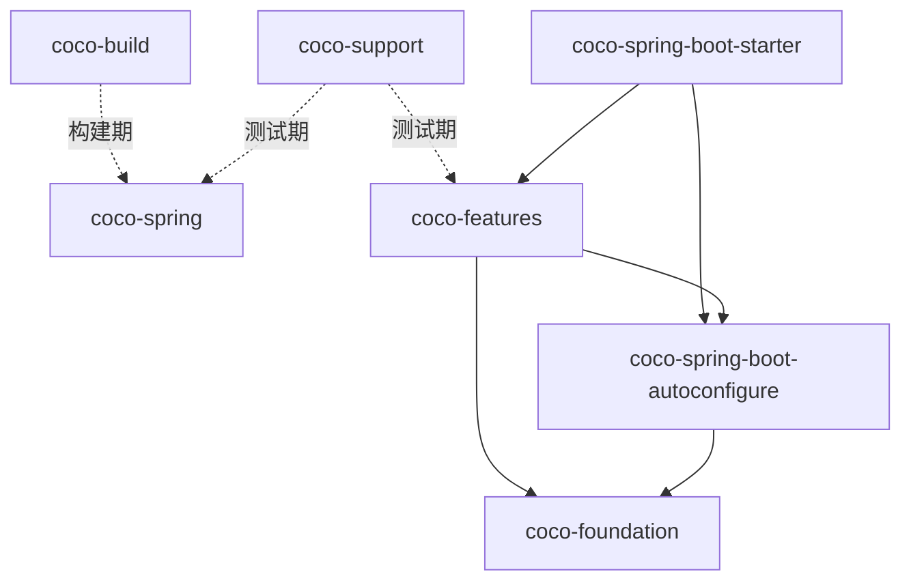

# Coco Framework 模块布局

## 总览

仓库按职责划分为五个外层目录。外层目录表达所有权和依赖方向，实际供业务项目消费的是其中发布到 Maven Central 的制品。

```text
coco-build/
  coco-dependencies
  coco-parent
  coco-maven-plugin
coco-foundation/
  coco-api
  coco-context
  coco-i18n
  coco-exception
  coco-logging
  coco-feature-model
coco-spring/
  coco-spring-boot-autoconfigure
  coco-spring-boot-starter
coco-features/
  coco-web
  coco-security
  coco-audit
  coco-mybatis-plus
  coco-tenant
  coco-data-permission
  coco-openapi
coco-support/
  coco-test-support
```

## 外层目录

| 目录 | 制品 | 职责 |
| --- | --- | --- |
| `coco-build` | `coco-dependencies`, `coco-parent`, `coco-maven-plugin` | 依赖管理、推荐父 POM、feature 清单和打包裁剪 |
| `coco-foundation` | `coco-api`, `coco-context`, `coco-i18n`, `coco-exception`, `coco-logging`, `coco-feature-model` | 稳定契约、通用基础设施和与 Spring 无关的 feature 模型 |
| `coco-spring` | `coco-spring-boot-autoconfigure`, `coco-spring-boot-starter` | Spring Boot 自动配置、运行时 feature 计划和单 starter 入口 |
| `coco-features` | `coco-web`, `coco-security`, `coco-audit`, `coco-mybatis-plus`, `coco-tenant`, `coco-data-permission`, `coco-openapi` | 可独立启停的具体服务器能力 |
| `coco-support` | `coco-test-support` | 面向框架和业务应用的测试辅助能力 |

## 业务应用入口

正常业务应用只需要使用 `coco-parent` 并声明 `coco-spring-boot-starter`。无法继承父 POM的项目可以导入 `coco-dependencies`，再显式配置所需构建插件。

```xml
<parent>
    <groupId>io.github.patton174</groupId>
    <artifactId>coco-parent</artifactId>
    <version>${coco.version}</version>
    <relativePath/>
</parent>

<dependencies>
    <dependency>
        <groupId>io.github.patton174</groupId>
        <artifactId>coco-spring-boot-starter</artifactId>
    </dependency>
</dependencies>
```

业务项目通常不应直接依赖 `coco-spring-boot-autoconfigure` 或为每个默认 feature 手工维护一组依赖。starter 和构建期 feature 计划共同负责正常组合。

## 制品迁移

当前布局收敛了 1.x 中按实现阶段形成的名称。升级时应按下表替换 Maven 坐标和仓库路径：

| 1.x 制品或目录 | 当前制品或位置 |
| --- | --- |
| `coco-bom` | `coco-dependencies` |
| `coco-api-core` | `coco-api` |
| `coco-common-context` | `coco-context` |
| `coco-common-exception` | `coco-exception` |
| `coco-common-i18n` | `coco-i18n` |
| `coco-common-logging` | `coco-logging` |
| `coco-feature-registry` | `coco-feature-model` |
| `coco-config`, `coco-feature-runtime` | 合并到 `coco-spring-boot-autoconfigure` |
| `coco-feature-web` | `coco-web` |
| `coco-feature-security` | `coco-security` |
| `coco-feature-audit` | `coco-audit` |
| `coco-feature-mybatis-plus` | `coco-mybatis-plus` |
| `coco-feature-tenant` | `coco-tenant` |
| `coco-feature-data-permission` | `coco-data-permission` |
| `coco-feature-openapi` | `coco-openapi` |
| `coco-test` | `coco-test-support` |
| `coco-feature-codegen`, `coco:generate` | 移出 Framework；使用 [coco-generate](https://github.com/patton174/coco-generate) |
| `coco-samples` | 移出 Framework；产品接入参考 [coco-admin](https://github.com/patton174/coco-admin) |

这是制品边界调整，不应通过同时发布旧名和新名来永久维持两套架构。需要兼容时，应在版本说明中明确迁移窗口和退出条件。

## 依赖方向



禁止 foundation 反向依赖 `coco-spring` 或具体 feature，也禁止把 feature 实现移动到 starter。i18n、logging 可以使用自身职责所需的窄 Spring/SLF4J API，但 Spring Boot 自动配置必须留在 `coco-spring-boot-autoconfigure`。此方向是模块评审和新制品归属判断的默认依据。
