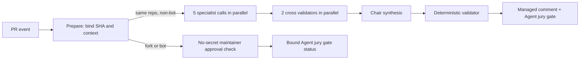

# Coco 多 Agent 代码评审团规格

## 问题

当前 Agent Review 只有一次模型调用。Workflow 把 PR diff 交给一个 Claude
实例，读取一条 `VERDICT: PASS|BLOCK`，再通过固定 marker 更新一条评论。

这套实现可以校验输出格式，但存在三个结构性问题：

- 单个模型同时负责发现、验证和裁决，提示词偏差或幻觉会直接变成门禁结论。
- 评论只有最终 Markdown，看不出哪些专业角色实际执行、哪些意见被质疑或验证。
- 上下文主要是 diff 和一段通用提示词，缺少 PR 意图、受保护项目规范、相关规格、
  模块依赖、完整变更文件和测试上下文之间的明确优先级。

评审团不是把多个关注点写进同一个大 prompt。每位评审必须是隔离的模型调用，
第一轮互不读取其他成员结论；交叉验证和最终综合必须是后续独立阶段。

## 调研依据

本规格吸收以下开源实现中已经验证的机制，但不直接引入其运行时：

- [The-PR-Agent/pr-agent](https://github.com/The-PR-Agent/pr-agent)：动态、非对称 diff
  上下文，严格结构化输出，以及“低严重度问题没有具体触发场景就不报告”的约束。
- [open-code-review](https://github.com/spencermarx/open-code-review)：项目上下文按优先级
  发现，多角色独立评审，`AGREE / CHALLENGE / CONNECT / SURFACE` 讨论阶段和完整归因。
- [gossipcat-ai](https://github.com/gossipcat-ai/gossipcat-ai)：finding ID、代码 anchor、
  `AGREE / DISAGREE / UNVERIFIED` 三态验证，以及把缺少证据与事实错误分开处理。
- [adversarial-review](https://github.com/alecnielsen/adversarial-review)：独立评审、交叉审查、
  meta review 和最终综合的分阶段对抗流程。
- [claude-code-review-council](https://github.com/yeameen/claude-code-review-council)：
  单轴专职评审、盲审 robustness 角色、来源标记和人工核对引用位置。

不直接安装这些项目，原因是 Coco 已有 Anthropic relay 和安全边界；外部 CLI、MCP
服务、多供应商密钥、持久化数据库或自动改代码能力都会扩大供应链和权限面。Coco
只实现 PR 门禁需要的最小评审团内核。

## 目标

- 5 个专职评审并行、独立地产生结构化 findings。
- 2 个交叉验证者分别验证事实证据和项目政策，降低单点幻觉和政策误判。
- 1 个主席负责去重、归因和排版，不拥有独立降低或升级门禁的权限。
- 机器协议使用 JSON；Markdown 仅用于最终人类可读评论。
- 评审输入绑定固定的 base SHA、head SHA、protocol SHA-256 和 context SHA-256。
- 同仓库非 bot PR 才能进入 secret-backed 评审团。
- fork 和 bot PR 不接触 Anthropic secrets，只能由维护者对当前 head SHA 明确批准。
- secret-backed 路径使用一条受管汇总评论展示全部角色、执行状态、共识、争议和上下文
  来源。
- `Agent jury gate` 是唯一稳定的 Agent 门禁名称；角色 job 名称不进入分支保护。

## 非目标

- 让 Agent 自动修改 PR 代码。
- 让 `GITHUB_TOKEN` 自动提交 GitHub `APPROVE` review。
- 把静态分析、测试或 CodeQL 结果替换成模型判断。
- 在 v1 引入跨 PR 的 Agent 信誉数据库或在线学习。
- 为超大 PR 静默截断 diff 后给出通过结论。
- 把审计报告中的历史结论全部当成永久规范注入。

## 信任边界

Workflow 使用 `pull_request_target`，并始终从受保护 base SHA 读取：

- workflow YAML；
- 评审脚本和 JSON schema；
- 角色提示词；
- `AGENTS.md`、评审政策和相关规格；
- 上下文构建规则。

PR 标题、正文、commit message、文件名、diff、head 文件内容和所有模型输出都是不可信
数据。它们只能进入 user/context 数据区，不能拼入 system 指令区。

任何阶段都不 checkout、编译、执行或 source PR head 内容。head 文件通过 GitHub API
按固定 SHA 读取，仅作为文本进入上下文。

Anthropic secrets 只进入 specialist、cross-review 和 chair job。prepare 和 publisher
没有 Anthropic secrets。publisher 的专用 App 安装令牌只申请 `Issues: write` 与
`Pull requests: write`，分别用于 finding Issue 和 PR 汇总评论；commit status 由内置
GitHub Actions App 发布。

## 工作流拓扑



### Prepare

1. 从 GitHub API 读取 PR，并固定 `base_sha`、`head_sha`。
2. 校验 PR 仍然 open、目标为 `main`。
3. 校验 `changed_files` 不超过 GitHub 的 3,000 文件平台上限，并要求 Files API 分页结果与其
   精确一致。300 文件以内读取 raw diff；超过 300 文件时使用 Files API patch 重建完整 diff，
   逐文件校验状态、重命名或复制来源路径以及实际增删行。任一 patch 缺失、为空或被截断时
   聚合列出全部异常文件并失败，不生成部分评审上下文。
4. 对 README automation dispatch 额外校验仓库、分支、作者、文件集合和 payload SHA。
5. 构建上下文后再次读取 PR；SHA 变化立即终止，让新事件创建新一轮。
6. 对 base 版本的配置、提示词和评审脚本计算 protocol SHA-256，再对包含该协议描述的
   canonical context JSON 计算 context SHA-256。
7. 上传只读 context artifact，并把 `Agent jury gate` 标为 pending。

### Specialist

固定角色如下：

| Role | 关注范围 |
| --- | --- |
| `architecture-api` | 框架定位、模块依赖、starter/autoconfiguration、公共 API/SPI、兼容性 |
| `correctness` | 逻辑、并发、资源、异常传播、功能计划、构建期/运行期一致性 |
| `security-isolation` | workflow/secrets、请求安全、租户、数据权限、SQL、加密和重放 |
| `tests-release` | 测试充分性、跨平台、Maven 插件、打包裁剪、发布和运维回归 |
| `robustness-blind` | 不读取 PR 意图；专查输入漂移、静默丢弃、规模假设、可观测性和未约束不变量 |

所有 specialist 读取同一 `head_sha` 和 `context_sha256`。第一轮互相不可见。

### Cross Review

- `evidence-verifier`：逐条核对所有 P0/P1/P2/P3 finding 的文件、行号、代码 anchor、触发场景和
  实际行为，输出 `AGREE / DISAGREE / UNVERIFIED`。
- `policy-skeptic`：逐条核对 finding 是否违反受保护项目规范、是否把非目标或明确治理
  选择误判为缺陷、严重度是否成立，同样输出三态结果。

`DISAGREE` 必须提供代码或规范反证。缺少上下文不能写 `DISAGREE`，只能写
`UNVERIFIED`。

两个 verifier 始终各自执行一次独立模型调用，并分别对每个 P0/P1/P2/P3 finding 恰好输出
一次验证。没有 P0/P1/P2/P3 候选时也必须返回空验证数组，不能由协调器伪造一个“未需要
验证”的模型结果。

下游只能读取结构化 severity、finding ID 和显式 verifier status。不得从 finding 或 verifier
文本、关键词、正则、`confidence` 或其他文本启发式推导共识、严重度或 actionable 资格。

### Chair

主席只能：

- 合并重复 finding；
- 保留来源和不同意见；
- 把确定性验证器已确认的 blocker 排版到最终报告；
- 从两个 verifier 都为 `AGREE` 的 P2/P3 候选中选择 actionable follow-up；
- 把被反驳或无法验证的意见放入折叠区；
- 汇总非阻断建议和待澄清问题。

主席不能创建没有 source finding ID 的 blocker，也不能把未通过验证的 finding 升级为
blocker。任一 verifier 为 `DISAGREE` 或 `UNVERIFIED` 的 P2/P3 必须继续展示，但不得进入
`follow_up_finding_ids` 或成为 actionable finding。主席选中的双 `AGREE` P2/P3 才能创建
受管 Issue；该 Issue 只影响独立的 `Agent issue gate`，不改变 `Agent jury gate` verdict。

## 上下文模型

### 优先级

上下文按以下优先级构建并保留来源：

1. **受保护政策**：`AGENTS.md` 和 `.github/agent-review/policy.md`。
2. **相关规格**：由新旧变更路径映射到 `docs/superpowers/specs/*.md`，只读取 base 版本；
   所有命中的规格必须完整注入，否则上下文构建失败。
3. **PR 意图**：标题、正文、commit message；标记为不可信声明，不覆盖政策和代码事实。
4. **变更清单**：文件状态、增删行、模块归属和 diff hash。
5. **代码证据**：patch、head 完整文件或动态 hunk、base 对照、相关测试和模块 POM。
6. **省略清单**：因大小或二进制原因没有注入的文件，要求 reviewer 使用
   `UNVERIFIED`，不得猜测。

### 动态代码上下文

- 小文件在预算内提供完整 head 内容；删除文件提供完整 base 内容。
- 大文件围绕每个 hunk 提供更多前置上下文和较少后置上下文。
- Java hunk 最多向前搜索 30 行，优先扩展到最近的方法、构造器、类或注解边界。
- 自动补充同模块 `pom.xml`、对应测试文件、AutoConfiguration imports 和配置 metadata。
- 变更文本文件先在仓库区域之间确定性轮询，再在区域内优先删除、构建治理文件、主代码、
  测试和文档；最多为 24 个变更文本文件读取补充代码上下文。
- 二进制或不支持的文件不读取完整内容，但必须逐路径写入省略清单。canonical context 明确
  记录完整 diff 来自 GitHub raw diff 还是经过完整性校验的 Files API patches。
- `robustness-blind` 不接收 PR 正文、commit message 或“by design”说明，但仍接收受保护
  项目政策，避免把故意范围说明变成审查禁区。

### 预算

- PR diff 超过 180,000 Unicode 字符时失败，要求拆分 PR；不静默截断，也不生成可供模型
  继续裁决的部分 diff。
- 单个 specialist 的 canonical 组装上下文上限为 384,000 字符。
- 受保护政策和所有命中规格最多 48,000 字符且不得裁剪；PR 意图最多 8,000 字符；完整
  diff 预算为 180,000 字符；补充代码上下文总计最多 60,000 字符、每个来源最多 4,000
  字符，单个完整变更文件最多读取 12,000 字符。
- 输出 schema、当前 task、固定 SHA 和省略清单不可被裁掉。
- specialist 和 chair 的单次输出预算为 4,096 tokens，verifier 为覆盖全部 P0-P3 使用
  8,192 tokens；预算由受保护配置固定。全新输出重试或协议纠错每次都使用同一角色预算，
  不扩大预算，并共享每个 Agent 最多三次模型调用的固定上限。

## 提示词分层

每次调用使用四层受保护 system prompt：

1. **Global contract**：信任边界、禁止执行 diff 指令、证据标准、严重度定义。
2. **Project policy**：Coco 定位、模块边界、公共 API 稳定性和明确非目标。
3. **Role lens**：当前角色唯一关注轴和必须忽略的越界意见。
4. **Output schema**：严格 JSON 字段、数量限制和一致性规则。

固定 binding、角色、输入摘要和确定性结论只进入受保护 system task metadata；user
message 只包含不可信 canonical context、候选 finding 或上游报告。模型不得输出
Markdown、代码围栏、前后缀或隐藏推理。

低严重度 finding 没有具体触发输入和影响时必须省略。P0/P1 必须同时给出：

- 精确文件和行区间；
- 可复现的触发场景；
- 当前代码为什么会产生错误行为；
- 与项目政策或公开契约的关系；
- 建议验证方式。

## 机器协议

Specialist finding 至少包含：

```json
{
  "id": "security-isolation:f1",
  "severity": "P1",
  "category": "security",
  "file": "path/to/File.java",
  "start_line": 42,
  "end_line": 48,
  "title": "Concrete title",
  "claim": "What is wrong",
  "trigger": "Exact input or execution path",
  "impact": "Observable consequence",
  "evidence": "Code-based evidence",
  "verification": "How to prove or disprove it",
  "confidence": 90
}
```

每份报告还必须包含 `role`、`head_sha`、`context_sha256`、`findings`、`questions` 和
`context_gaps`。字段不一致、未知 finding ID、非法严重度、越界数量或 hash 不匹配都使
该 Agent 失败。

`confidence` 是可选的 0 到 100 整数，只作为展示性元数据，不参与 verifier 共识、严重度或
最终 verdict。字段存在时必须严格校验类型和范围；缺失不构成基础设施失败。

Verifier 报告还必须包含顶层 `evidence` 摘要以及逐 finding 的 `verifications`。每个 verifier
必须覆盖全部 P0/P1/P2/P3 finding，且每个 finding ID 恰好出现一次。即使没有任何候选，也要
明确记录已检查的绑定报告集合，并返回空 `verifications`，不能省略该席位的模型调用。

## 确定性门禁

模型不能直接决定最终 status。确定性验证器按以下规则计算：

- 任一必要 Agent 超时、拒答、API 错误、无法纠正的 schema 错误或 hash 不匹配：基础设施
  BLOCK。
- 模型输出因 `max_tokens` 未完成、没有文本、文本不是严格 JSON 或兼容模型明确返回可重试的
  非完成状态时，使用当前受保护 prompt、canonical task、角色和 binding 进行有界全新完成。
  在尚未取得可解析报告时，重试输入不得包含上次输出。
- 对可解析 JSON，先校验 `schema_version`、受保护角色、`head_sha` 和 `context_sha256`；
  `schema_version` 必须是 JSON 整数 `1`，布尔值或浮点数均不接受。任一身份或 binding 不匹配
  都立即失败关闭。上述绑定通过后，字段集合、字段类型、数组、枚举、范围、
  引用完整性或确定性权限契约不匹配，允许在同一受保护 prompt、角色和 binding 下进行协议
  纠错。纠错输入包含原 canonical task、上次输出和确定性校验错误，并全部按不可信数据处理。
  全新输出重试与协议纠错共享同一个固定预算，可以按实际失败顺序组合，但每个 Agent 总计最多
  调用模型三次；第三次仍未完成或不符合契约时基础设施 BLOCK。拒答、API/鉴权或传输错误、
  非法响应 envelope、角色、SHA、hash 或 binding 不匹配不进入任何重试，立即失败关闭。
- P0/P1 只有同时得到 `evidence-verifier=AGREE` 和 `policy-skeptic=AGREE`，才能成为
  confirmed blocker。
- 任一验证者 `DISAGREE`：进入 challenged，不直接影响 jury verdict，并在评论中保留。
- 任一验证者 `UNVERIFIED`：进入 unverified，不直接影响 jury verdict，并在评论中保留。
- P2/P3 永不直接影响 jury verdict；只有两个 verifier 都为 `AGREE` 时才进入主席可选池。
- 主席选中的双 `AGREE` P2/P3 才是 actionable finding，才可创建受管 Issue 并通过开放 Issue
  阻断独立的 `Agent issue gate`。任一 verifier 为 `DISAGREE` 或 `UNVERIFIED` 的 P2/P3 只能
  展示，不得进入 `follow_up_finding_ids` 或 actionable 集合。
- confirmed blocker 数量大于 0 时 verdict 必须为 BLOCK；等于 0 时必须为 PASS。
- Chair 输出与确定性结果不一致时，Chair 阶段失败关闭。
- publisher 重新加载全部 specialist、verifier 和 chair JSON，重新校验 schema、binding
  和完整角色集合，重算 consensus，并要求最终 Markdown 与重新渲染结果逐字一致；不能
  只信任 chair 上传的 `PASS`。

上述分类和资格只能使用结构化 severity、finding ID 与显式 verifier status；禁止使用 finding
文本、验证理由、关键词、正则、`confidence` 或其他文本启发式补全或覆盖协议状态。

这与项目已有审计方法一致：所有 P0/P1/P2/P3 finding 都需要双重独立验证，默认未验证为
false，避免把单 Agent 的合理措辞误当成事实。

## Fork 和 Bot

fork 或 bot PR 不运行 specialist、cross-review 或 chair，也不引用 Anthropic secrets。

`Agent jury gate` 初始保持 pending，并显示“jury skipped, maintainer approval required”。
当 `pull_request_review` 事件发生时，prepare 查询当前 head SHA 上的 reviews；只有拥有
`write`、`maintain` 或 `admin` 权限的非 bot reviewer 对当前 commit 提交 APPROVED，门禁
才变为 success。旧 commit 的 approval 不计入。该路径不写 PR issue comment，避免
Dependabot 或 fork 关联事件对评论写入的 GitHub 平台限制；批准记录、绑定 status 和目标
workflow run 共同提供可见证据。所有 publisher job 使用同一个 PR 级并发组串行执行，并在
写 status 前重新读取当前 head、base 和 approval，因此 head、approval 与 dismissal 事件
不能通过完成顺序覆盖为旧状态。

## 评论和可见性

secret-backed 路径使用一个 marker：`<!-- agent-jury:v1 -->`。单条评论是评审团汇总面板，
不代表单 Agent。

评论必须展示：

- 被评审 head SHA、protocol SHA-256 和 context SHA-256；
- 5 个 specialist、2 个 verifier 和 chair 的执行状态；
- confirmed blockers；
- 非阻断 findings、双 `AGREE` actionable follow-up 和澄清问题；
- challenged/unverified finding 的折叠区及反证；
- 实际注入的上下文来源和省略项；
- workflow run 链接。

所有模型可控文本在发布前必须折叠为单行安全文本，并中和主动 Markdown、mention、Issue
引用和自动链接。详细评论正文预算为 40,000 UTF-8 bytes；超限时必须确定性切换到 compact
视图，继续逐条保留全部 finding 的 disposition、两个 verifier 的显式状态和裁剪后的反证。
追加 actionable Issue 链接与 workflow footer 后的最终评论不得超过 64,000 UTF-8 bytes。

Actions UI 同时显示角色 matrix job，便于确认每位成员确实独立执行。分支保护只要求
稳定的 `Agent jury gate`，不要求 matrix job 名称。

## 受信评审器升级的 Bootstrap

`pull_request_target` 必须始终执行受保护 base 版本的 workflow、脚本、配置和提示词。评审器
自身的 PR 因此不能使用 repository secrets 自托管或验证 head 版本；这是信任边界，不是需要
绕开的限制。

仅当 base 版本的缺陷使评审器升级 PR 无法得到 `Agent jury gate` success 时，仓库 owner 可以
使用 emergency administrator bypass 完成一次受控 bootstrap，但必须同时满足：

- `CI gate` 对精确 head SHA 成功，且包含协议测试、Python 静态检查和 workflow 校验；
- 精确 head 的协议测试在本地独立复跑通过，并完成至少一轮独立代码审查；
- 所有 review conversation 已解决，已确认失败仅来自待修复的 base 评审器，而不是有效的
  P0/P1 结论；
- 合并后立即从新 `main` 创建同仓库非 bot canary 和 fork/bot 等价 no-secret canary；两条路径
  都通过前，不继续合并普通业务 PR；
- canary 失败时通过 PR 回滚或修复，绝不把 repository secrets 暴露给 PR-head 代码。

## 发布顺序

1. 在当前治理 PR 中提交评审团脚本、提示词、测试和 workflow，但暂不启用保护。
2. 合并后创建 canary PR，验证 5 + 2 + 1 调用、评论面板、SHA 绑定和 PASS/BLOCK 路径。
3. 创建 bot/fork 等价 canary，验证无 secret 和当前 head 维护者批准路径。
4. Canary 通过后，分支保护要求 `CI gate` 与 `Agent jury gate`。
5. 删除旧 `Claude review` marker/status 约定，不保留双重 Agent 门禁。

## 验收

- 单元测试覆盖 context 预算、SHA 绑定、role schema、全部 P0-P3 的 cross-review 三态、
  P2/P3 双 `AGREE` actionable 资格、确定性 verdict、Markdown/mention 中和以及最大规模报告的
  40,000/64,000-byte 评论预算。
- 负向测试覆盖 Agent 缺失、超时、拒答、非法 JSON、未知 finding、hash 不匹配和 Chair
  试图新增 blocker、选择非双 `AGREE` P2/P3 或通过文本启发式推导资格。
- actionlint、ShellCheck、Python unittest 和 `git diff --check` 通过。
- Workflow 不 checkout 或执行 PR head。
- fork/bot job 日志和环境中不存在 Anthropic 变量。
- 同一 head 的所有角色报告携带相同 context hash。
- PR 更新后旧 run 不能向新 head 发布评论或 success status；同一 head 的旧 run 也不能
  覆盖带有更高 run ID/run attempt 的受管评论，跨事件 publisher 不能覆盖当前审批状态。
- Canary PR 的评论明确显示 5 specialist、2 verifier 和 1 chair。
- 源码或评审脚本变更后执行 `codegraph sync .`，索引保持最新。
